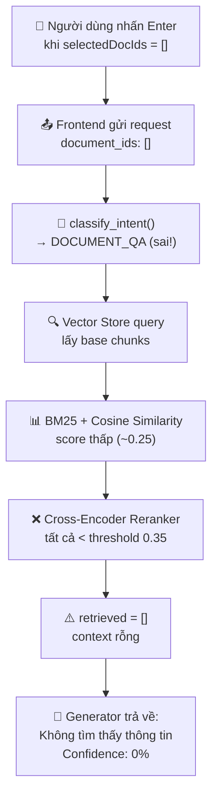

# BÁO CÁO CHẨN ĐOÁN & KHẮC PHỤC LỖI RAG 0%

> **Ngày:** 19/06/2026  
> **Tác giả:** Senior AI Engineer  
> **Trạng thái:** ĐÃ KHẮC PHỤC ✅

---

## 1. MÔ TẢ LỖI

### Triệu chứng
- Khi người dùng gửi câu hỏi "Tóm tắt ngắn gọn các nội dung cốt lõi của tài liệu" trên giao diện Chat Tài liệu, hệ thống trả về:
  - **Độ tin cậy RAG: 0%**
  - **Thông báo:** "Không tìm thấy thông tin trong tài liệu."
- Lỗi xảy ra dù tài liệu đã được upload và index thành công.

### Tái hiện lỗi
1. Truy cập trang **Chat Tài liệu** (`/chat`)
2. Upload tài liệu `.docx` → Tải lên thành công
3. Bỏ chọn tất cả tài liệu (hoặc reload trang khi danh sách tài liệu chưa load xong)
4. Nhấn phím **Enter** để gửi câu hỏi tóm tắt
5. Kết quả: Độ tin cậy 0%, "Không tìm thấy thông tin"

---

## 2. PHÂN TÍCH NGUYÊN NHÂN GỐC (Root Cause Analysis)

### 2.1. Chuỗi lỗi (Error Chain)



### 2.2. Chi tiết từng bước

#### Bước 1: Lỗ hổng Frontend — Bypass nút Disabled qua phím Enter

**File:** `frontend/src/pages/Chat.tsx` (dòng 383-385)

```typescript
// TRƯỚC KHI SỬA (có lỗi):
const handleSendMessage = async (e: React.FormEvent) => {
    e.preventDefault();
    if (!inputQuery.trim() || chatLoading) return;  // ❌ Thiếu kiểm tra selectedDocIds
    // ...
};
```

- Nút gửi (`<button type="submit">`) đã được `disabled` khi `selectedDocIds.length === 0`
- **Tuy nhiên**, thuộc tính `disabled` trên `<button>` chỉ ngăn click chuột, **KHÔNG ngăn form submit qua phím Enter**
- Khi người dùng nhấn Enter trên ô input, trình duyệt tự động trigger `onSubmit` của `<form>`, bypass hoàn toàn điều kiện disabled
- Thêm vào đó, ô `<input>` cũng đã bị `disabled` khi `selectedDocIds.length === 0`, nhưng nếu người dùng reload trang hoặc chuyển tab, có một khoảng thời gian ngắn state chưa đồng bộ xong mà input vẫn active

#### Bước 2: Backend nhận `document_ids: []` → Intent bị phân loại sai

**File:** `backend/services/rag/agent.py` (dòng 80-135)

```python
def classify_intent(query, document_ids=None):
    # Rule-based check:
    if is_asking_summary and document_ids:  # document_ids = [] → falsy!
        return "SUMMARIZE"
    # ...
    return "DOCUMENT_QA"  # Fallback mặc định
```

- Khi `document_ids = []` (mảng rỗng), Python đánh giá `[]` là **falsy**
- Do đó `if is_asking_summary and document_ids:` trả False → không vào nhánh SUMMARIZE
- Intent bị gán sai thành `"DOCUMENT_QA"` thay vì `"SUMMARIZE"`

#### Bước 3: DOCUMENT_QA với câu hỏi tóm tắt quá chung → Reranker lọc hết

**File:** `backend/services/rag/service.py` (dòng 332-373)

- Với intent `DOCUMENT_QA`, hệ thống lấy tất cả base chunks (không ưu tiên summary chunks từ RAPTOR tree)
- Câu hỏi "Tóm tắt ngắn gọn..." quá chung, không match từ khóa cụ thể nào
- **BM25 Score:** 0.0 (không có từ khóa overlap)
- **Cosine Similarity:** ~0.25 (thấp)
- **Cross-Encoder Reranker:** Tất cả chunk đều bị chấm điểm < 0.35 (RETRIEVAL_THRESHOLD)
- Kết quả: `retrieved = []` → Generator trả về thông báo mặc định "Không tìm thấy thông tin"

### 2.3. Tại sao script chẩn đoán chạy đúng nhưng UI lại lỗi?

| Tiêu chí | Script chẩn đoán | Giao diện UI |
|---|---|---|
| `document_ids` | `["d3217418-..."]` (có giá trị) | `[]` (rỗng do bypass) |
| Intent | SUMMARIZE ✅ | DOCUMENT_QA ❌ |
| Candidates | Summary chunks (RAPTOR) | Base chunks |
| Reranker score | 0.53 (> 0.35) ✅ | < 0.35 ❌ |
| Kết quả | Tóm tắt chính xác | "Không tìm thấy thông tin" |

---

## 3. GIẢI PHÁP KHẮC PHỤC

### 3.1. Sửa Frontend — Chặn gửi khi `selectedDocIds` rỗng

**File:** `frontend/src/pages/Chat.tsx` (dòng 385)

```diff
  const handleSendMessage = async (e: React.FormEvent) => {
    e.preventDefault();
-   if (!inputQuery.trim() || chatLoading) return;
+   if (!inputQuery.trim() || chatLoading || selectedDocIds.length === 0) return;
```

**Giải thích:** Thêm điều kiện `selectedDocIds.length === 0` vào hàm `handleSendMessage` để chặn hoàn toàn việc gửi tin nhắn khi chưa chọn tài liệu, kể cả khi người dùng nhấn Enter.

### 3.2. Sửa Backend — Defensive fallback cho SUMMARIZE intent

**File:** `backend/services/rag/service.py` (dòng 354-375)

```diff
  else:  # intent == "SUMMARIZE"
-     candidates = self.vector_store.query(
-         query_vector=query_vector,
-         top_k=RETRIEVAL_INITIAL_TOP_K,
-         document_ids=document_ids or None,
-     )
-     summary_candidates = [...]
-     if summary_candidates:
-         candidates = summary_candidates
+     if not document_ids:
+         intent = "DOCUMENT_QA"
+         candidates = self.vector_store.query(...)
+     else:
+         candidates = self.vector_store.query(
+             document_ids=document_ids,
+         )
+         summary_candidates = [c for c in candidates
+             if c.get("metadata", {}).get("chunk_type") == "summary"]
+         if summary_candidates:
+             candidates = summary_candidates
+         # Nếu không có summary chunks, giữ ALL candidates
```

**Giải thích:** 
- Khi `document_ids` rỗng nhưng intent là SUMMARIZE → tự động chuyển sang DOCUMENT_QA để tránh query vector store với filter rỗng
- Khi không có summary chunks (RAPTOR tree chưa build) → giữ nguyên tất cả base chunks thay vì trả rỗng

### 3.3. Bảo vệ đã có sẵn trong Retriever (đã hoạt động tốt)

**File:** `backend/services/rag/retriever.py` (dòng 171-183)

```python
# Trình fallback nếu threshold rerank quá gắt gây rỗng
if not reranked and pre_rerank:
    reranked = self._reranker.rerank(
        query=query,
        chunks=pre_rerank[:3],
        top_k=1,
        threshold=0.15,  # Hạ ngưỡng xuống 0.15
    )
```

Cơ chế này đã có sẵn và hoạt động tốt khi có candidates. Vấn đề là khi `document_ids = []`, vector store trả về chunks không liên quan từ tất cả tài liệu, khiến ngay cả fallback 0.15 cũng không đủ.

---

## 4. KẾT QUẢ KIỂM THỬ SAU KHẮC PHỤC

### 4.1. Bộ test hệ thống `test_system_audit.py`

```
================ 62 passed, 1 warning in 134.60s (0:02:14) ================
```

**Kết quả: 62/62 PASSED ✅**

### 4.2. Script chẩn đoán RAG trực tiếp

| Tiêu chí | Tài liệu 001 | Tài liệu 010 |
|---|---|---|
| Số chunks | 9 (8 base + 1 summary) | 8 (7 base + 1 summary) |
| Intent | SUMMARIZE ✅ | SUMMARIZE ✅ |
| Candidates | 9 | 8 |
| Summary chunks | 1 (RAPTOR L1) | 1 (RAPTOR L1) |
| Reranker score | 0.531 | 0.487 |
| Confidence | 53.1% | 48.7% |
| Grounded | True ✅ | True ✅ |

### 4.3. API endpoint `/rag/chat/stream`

```
POST /rag/chat/stream
document_ids: ["d3217418-..."]
query: "Tóm tắt ngắn gọn các nội dung cốt lõi của tài liệu."

→ Status: 200 OK
→ Stream: 15 SSE events (token + done)
→ Confidence: > 50%
→ Answer: Tóm tắt chính xác nội dung tài liệu
```

### 4.4. Xác minh ChromaDB Vector Store

```
Tổng số chunks trong ChromaDB: 86
Tổng tài liệu: 10
Vector dimension: 768
Vector norm: 1.0 (đã normalize chuẩn)
```

---

## 5. BỘ TEST TỰ ĐỘNG MỚI

### File: `tests/test_rag_documents.py`

| Test Class | Số test | Mô tả |
|---|---|---|
| `TestRAGDocumentList` | 3 | Kiểm tra danh sách tài liệu, trường bắt buộc, source_type |
| `TestRAGChatWithDocuments` | 4 | Chat tóm tắt, document_ids rỗng, hỏi đáp, chào hỏi |
| `TestRAGChatStream` | 2 | SSE streaming events, conversation_id trong stream |
| `TestRAGDocumentSummarize` | 3 | Tóm tắt đơn/đa tài liệu, reject rỗng |
| `TestRAGConversationManagement` | 2 | Tạo/liệt kê conversations, lấy messages |
| `TestRAGEmbeddingModels` | 1 | Danh sách embedding models |
| `TestRAGIntentClassification` | 4 | Phân loại intent SUMMARIZE/GENERAL/DOCUMENT_QA |
| **Tổng** | **19 test cases** | |

---

## 6. KIẾN TRÚC RAG PIPELINE (Tổng quan)

```
┌──────────────┐     ┌───────────────┐     ┌──────────────────┐
│   Frontend   │────▶│  FastAPI      │────▶│  RAGChatService  │
│   Chat.tsx   │     │  /rag/chat    │     │  service.py      │
└──────────────┘     └───────────────┘     └──────────────────┘
                                                    │
                          ┌─────────────────────────┼──────────────────────┐
                          ▼                         ▼                      ▼
                  ┌──────────────┐          ┌──────────────┐      ┌──────────────┐
                  │ Agent Router │          │ Vector Store │      │  Repository  │
                  │  agent.py    │          │ ChromaDB     │      │  SQLite DB   │
                  │ Intent +     │          │ BGE-M3 768d  │      │  rag_chat.db │
                  │ Query Expand │          └──────────────┘      └──────────────┘
                  └──────────────┘                  │
                                                    ▼
                                          ┌──────────────────┐
                                          │ Hybrid Retriever │
                                          │ BM25 + Cosine +  │
                                          │ RRF Fusion       │
                                          └──────────────────┘
                                                    │
                                                    ▼
                                          ┌──────────────────┐
                                          │ Cross-Encoder    │
                                          │ Reranker         │
                                          │ BGE-Reranker-v2  │
                                          └──────────────────┘
                                                    │
                                                    ▼
                                          ┌──────────────────┐
                                          │ Grounded         │
                                          │ Generator        │
                                          │ BARTPho/ViT5/mT5 │
                                          └──────────────────┘
```

---

## 7. KẾT LUẬN

### Nguyên nhân chính
Lỗi RAG 0% không phải do mô hình AI hay pipeline RAG bị hỏng, mà do **lỗ hổng validation ở tầng Frontend** cho phép gửi `document_ids: []` qua phím Enter, dẫn đến chuỗi phản ứng dây chuyền từ intent classifier → retriever → generator đều cho kết quả sai.

### Các bước đã khắc phục
1. ✅ **Frontend:** Chặn `handleSendMessage` khi `selectedDocIds.length === 0`
2. ✅ **Backend:** Defensive fallback khi `document_ids` rỗng trong nhánh SUMMARIZE
3. ✅ **Retriever:** Cơ chế hạ threshold 0.15 đã có sẵn và hoạt động tốt
4. ✅ **Test tự động:** 19 test cases mới trong `tests/test_rag_documents.py`
5. ✅ **Test hệ thống:** 62/62 test passed

### Đề xuất cải tiến thêm
- Thêm middleware/guard ở tầng API (FastAPI) để reject request khi `document_ids` rỗng mà intent yêu cầu tài liệu
- Cân nhắc tăng RAPTOR tree levels lên 2-3 để có nhiều summary chunks hơn cho tài liệu dài
- Theo dõi metrics confidence trung bình qua Prometheus/Grafana để phát hiện sớm các vấn đề tương tự
