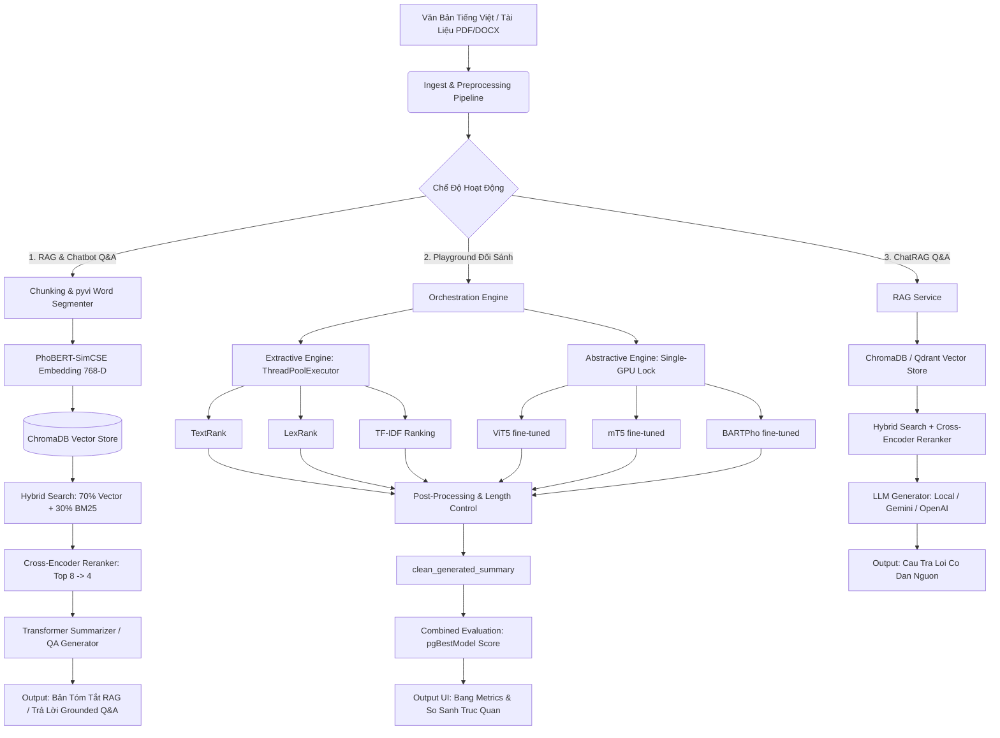

# Nghiên Cứu và Phát Triển Hệ Thống Tóm Tắt Văn Bản Tiếng Việt Sử Dụng Mô Hình Transformer
### So Sánh 6 Thuật Toán Tóm Tắt Trích Rút và Diễn Giải kết hợp Hệ Thống Hỏi Đáp ChatRAG trên Bộ Dữ Liệu Tin Tức VietNews
#### *Đồ Án Tốt Nghiệp — Vietnamese NLP Text Summarization System*

> **Dataset:** `nam194/vietnews` — 143,816 mẫu tin tức tiếng Việt (Tuổi Trẻ, VnExpress, Người Đưa Tin)  
> **Models:** ViT5, BARTPho, mT5 (fine-tuned) + TextRank, LexRank, TF-IDF (extractive) + ChatRAG

---

## 📝 Giới Thiệu Đề Tài (Abstract & Introduction)
Trong kỷ nguyên bùng nổ thông tin, việc rút trích và nắm bắt nhanh nội dung từ các văn bản dài (như tài liệu pháp lý, nghiên cứu khoa học, báo chí) đóng vai trò sống còn. Tiếng Việt là một ngôn ngữ đơn lập, có tính đơn âm tiết cao, từ ghép gồm nhiều âm tiết phân tách bằng khoảng trắng, tạo ra thách thức lớn đối với các mô hình xử lý ngôn ngữ tự nhiên (NLP) truyền thống.

Đồ án/Đề tài này xây dựng và triển khai một **Hệ thống Agentic RAG & Playground Đối Sánh Tóm Tắt Văn Bản Tiếng Việt Toàn Diện**. Hệ thống tích hợp song song hai trụ cột công nghệ cốt lõi:
1. **Playground Đối Sánh Đa Thuật Toán Thời Gian Thực:** So sánh hiệu năng của 6 giải thuật hàng đầu bao gồm các phương pháp **Trích xuất (Extractive)** cổ điển vững chắc toán học và các mô hình học sâu **Trừu tượng (Abstractive)** hiện đại dựa trên kiến trúc Sequence-to-Sequence (Seq2Seq) Transformer.
2. **Hệ thống Retrieval-Augmented Generation (RAG) & ChatRAG nâng cao:** Ứng dụng mô hình nhúng ngữ nghĩa PhoBERT-SimCSE, thuật toán tìm kiếm lai Hybrid Search kết hợp tách từ ghép `pyvi`, Cross-Encoder Reranking mạnh mẽ, cung cấp khả năng hội thoại thông minh có đối chiếu trích dẫn nguồn (Citation & Source Reference) chặt chẽ.

---

## 🏗️ 1. Sơ Đồ Kiến Trúc Hệ Thống (System Architecture & Pipeline)

Hệ thống được thiết kế theo mô hình kiến trúc phân lớp hướng dịch vụ (Service-Oriented Architecture), tối ưu hóa tính toán song song và quản lý tài nguyên GPU hiệu quả:



* **Luồng Playground:** Khi người dùng đưa vào văn bản gốc (và tóm tắt tham chuẩn tùy chọn), hệ thống khởi chạy song song 3 thuật toán Extractive qua đa luồng (`ThreadPoolExecutor`) CPU và xếp hàng tuần tự 3 thuật toán Abstractive qua bộ khóa GPU Semaphore (`_GPU_LOCK`) để đảm bảo an toàn bộ nhớ. Bản tóm tắt thô đi qua khâu hậu xử lý sửa câu cụt trước khi tính điểm tổng hợp `pgBestModel`.
* **Luồng RAG:** Văn bản tài liệu được chunking, tách từ tiếng Việt, biểu diễn vector 768-D qua PhoBERT-SimCSE, lập chỉ mục vào ChromaDB. Khi truy vấn, hệ thống thực hiện Hybrid Search kết hợp BM25 chuẩn hóa, sau đó lọc tinh qua Cross-Encoder Reranker đưa vào ngữ cảnh của LLM để sinh câu trả lời chính xác có dẫn nguồn trang cụ thể.

---

## 🧮 2. Cơ Sở Toán Học & Giải Thuật Tóm Tắt (Methodology & Core Algorithms)

### A. Nhóm Thuật Toán Trích Xuất (Extractive Summarization)
Nhóm thuật toán trích xuất hoạt động bằng cách chấm điểm các câu quan trọng nhất trong văn bản gốc và trích xuất nguyên bản để tạo thành bản tóm tắt.

#### 1. TextRank (Đồ thị dựa trên PageRank)
Thuật toán xây dựng một đồ thị vô hướng đầy đủ $G = (V, E)$, với mỗi đỉnh $V_i$ đại diện cho một câu trong văn bản. Trọng số của cạnh nối giữa hai đỉnh $V_i$ và $V_j$ được tính bằng hàm độ tương đồng câu dựa trên số lượng từ trùng lặp:

$$\text{Similarity}(S_i, S_j) = \frac{|\{w \in S_i \cap S_j\}|}{\log(|S_i|) + \log(|S_j|)}$$

Điểm quan trọng của các câu được hội tụ bằng phương pháp lặp PageRank với hệ số cản (damping factor) $d = 0.85$:
 (V_j)} \text{Similarity}(S_j, S_k)} PR(V_j)$$

#### 2. LexRank (Đồ thị dựa trên Cosine TF-IDF)
Tương tự như TextRank, nhưng độ tương đồng giữa hai câu $S_i$ và $S_j$ được tính bằng Cosine Similarity của các vector đặc trưng TF-IDF tương ứng ($\mathbf{x}_i, \mathbf{x}_j$):

$$\text{CosineSimilarity}(S_i, S_j) = \frac{\mathbf{x}_i \cdot \mathbf{x}_j}{\|\mathbf{x}_i\| \|\mathbf{x}_j\|} = \frac{\sum_{w} \text{tf}(w, S_i)\text{tf}(w, S_j)[\text{idf}(w)]^2}{\sqrt{\sum_{w} [\text{tf}(w, S_i)\text{idf}(w)]^2} \sqrt{\sum_{w} [\text{tf}(w, S_j)\text{idf}(w)]^2}}$$

Hệ thống xây dựng ma trận kề liên kết $A$:

$$A_{ij} = \begin{cases} \text{CosineSimilarity}(S_i, S_j) & \text{nếu } \text{CosineSimilarity}(S_i, S_j) \ge t \\ 0 & \text{trường hợp ngược lại} \end{cases}$$

với ngưỡng thực nghiệm $t = 0.1$. Điểm trung tâm (Centrality) được tính bằng Eigenvector Centrality thông qua thuật toán lũy thừa (Power Method).

#### 3. TF-IDF Sentence Ranking (Đánh giá câu dựa trên trọng số TF-IDF)
Mỗi câu $S_i$ được biểu diễn như một vector TF-IDF $\mathbf{x}_i \in \mathbb{R}^{|V|}$ trên không gian từ vựng $V$. Điểm quan trọng của câu được tính bằng tổng các trọng số TF-IDF:

$$\text{Score}(S_i) = \sum_{w \in S_i} \text{tf}(w, S_i) \cdot \log\frac{N+1}{df(w)+1} + 1$$

Đây là baseline lexical đơn giản nhưng hiệu quả cao, đặc biệt với văn bản tin tức có ngôn ngữ rõ ràng và từ khóa nổi bật.

---

### B. Nhóm Mô Hình Trừu Tượng (Abstractive Summarization - Seq2Seq Transformers)
Nhóm trừu tượng tự sinh ra các câu mới mang tính tổng hợp, sử dụng các mô hình ngôn ngữ lớn đã được tinh chỉnh (fine-tuned) trên tiếng Việt.

1.  **BARTPho (`vinai/bartpho-syllable`):** Kiến trúc sequence-to-sequence dựa trên BART được huấn luyện trước trên dữ liệu tiếng Việt quy mô lớn. Hoạt động ổn định nhất ở mức âm tiết (syllable-level), kiểm soát lặp từ xuất sắc nhờ cấu hình `repetition_penalty = 1.5` và `no_repeat_ngram_size = 4`.
2.  **ViT5 (`VietAI/vit5-base`):** Mô hình T5 được tối ưu hóa riêng cho tiếng Việt bởi VietAI. Cực kỳ hiệu quả trong tác vụ sinh tóm tắt học thuật, được huấn luyện tinh chỉnh trực tiếp trên tập dữ liệu báo chí tiếng Việt. Sử dụng `repetition_penalty = 2.2` để triệt tiêu hoàn toàn vòng lặp từ đặc trưng của kiến trúc T5.
3.  **mT5 (`google/mt5-base`):** Mô hình T5 đa ngôn ngữ của Google. Vì không gian vocabulary của mT5 rất lớn và chứa nhiều ký tự phi tiếng Việt, hệ thống cấu hình bộ lọc lấy mẫu hạt nhân (Nucleus Sampling) với `top_p = 0.90` và `temperature = 0.75` để duy trì sự đa dạng từ vựng và loại bỏ các ký tự rác.

---

### C. Cơ Chế Điều Khiển GPU & Hậu Xử Lý Thông Minh
*   **Tránh tràn VRAM (GPU CUDA OOM):** Đối với các mô hình học sâu, hệ thống bảo vệ tiến trình bằng luồng khóa độc quyền:
    ```python
    _GPU_LOCK = threading.Semaphore(config.MAX_GPU_CONCURRENT)
    ```
    Đảm bảo tại một thời điểm chỉ có duy nhất một mô hình Transformer được quyền thực thi inference trên GPU.
*   **Bộ dọn dẹp câu dở dang (`_clean_incomplete_sentence`):** Khi các mô hình Abstractive sinh từ vượt ngưỡng giới hạn tối đa (`Max Tokens`), câu cuối cùng thường bị cụt lửng (ví dụ: *"Đoàn tàu va chạm mạnh vào..."*). Hệ thống cài đặt bộ lọc bằng biểu thức chính quy (Regex) để truy hồi dấu chấm câu chuẩn kết thúc gần nhất và cắt bỏ phần dở dang:
    $$\text{Text}_{clean} = \text{SubString}\left(\text{Text}, 0, \text{index}(\text{Dấu kết thúc câu cuối cùng})\right)$$

---

## 🧮 3. Thuật Toán Tính Điểm Kết Hợp Chuyên Sâu (`pgBestModel`)

Để đánh giá một cách khoa học hiệu năng của các mô hình và tự động chỉ định mô hình chiến thắng ("Winner"), hệ thống áp dụng công thức **Điểm số kết hợp (Combined Score)** do chúng tôi tự nghiên cứu phát triển. Điểm số này dung hòa các yếu tố: Độ bao phủ n-gram, Độ tương đồng ngữ nghĩa sâu sắc, và Tỷ lệ nén lý tưởng.

```
                  ┌──────────────────────────────────────────────┐
                  │          Văn bản tóm tắt sinh ra             │
                  └──────────────────────┬───────────────────────┘
                                         │
                        {Kiểm tra sự tồn tại của Reference}
                                         │
                   ┌─────────────────────┴─────────────────────┐
                   ▼                                           ▼
       [CÓ tóm tắt tham chuẩn]                     [KHÔNG CÓ tóm tắt tham chuẩn]
                   │                                           │
  ┌────────────────┴────────────────┐         ┌────────────────┴────────────────┐
  │  - ROUGE-L (Trọng số 0.25)      │         │  - BERTScore F1 (Trọng số 0.45) │
  │  - ROUGE-2 (Trọng số 0.15)      │         │  - Sem. Similarity (Trọng số 0.35)│
  │  - BERTScore F1 (Trọng số 0.30) │         │  - Comp. Score (Trọng số 0.20)  │
  │  - Sem. Similarity (Trọng số 0.20)│       └────────────────┬────────────────┘
  │  - Comp. Score (Trọng số 0.10)  │                        │
  └────────────────┬────────────────┘                        │
                   │                                         │
                   └─────────────────────┬───────────────────┘
                                         ▼
                        ┌─────────────────────────────────┐
                        │      Combined Score [0 - 1]     │
                        └─────────────────────────────────┘
```

### A. Ý Nghĩa Của Các Chỉ Số Đánh Giá (Linguistic & Computational Metrics)

Hệ thống tích hợp bộ công cụ đo lường đa chiều nhằm đánh giá toàn diện cả về mặt cấu trúc lẫn ngữ nghĩa:

1. **ROUGE-1 (Unigram Overlap):**
   * **Ý nghĩa:** Đo lường tỷ lệ trùng lặp của các từ đơn lẻ (unigrams) giữa bản tóm tắt được sinh ra và bản tóm tắt tham chuẩn (hoặc văn bản gốc).
   * **Giá trị:** Phản ánh **Độ bao phủ thông tin (Information Coverage / Recall)**, giúp kiểm tra xem mô hình có giữ lại được các từ khóa cốt lõi không.

2. **ROUGE-2 (Bigram Overlap):**
   * **Ý nghĩa:** Đo lường tỷ lệ trùng lặp của các cặp hai từ liền kề (bigrams) giữa bản tóm tắt sinh ra và tham chuẩn.
   * **Giá trị:** Phản ánh **Độ trôi chảy cục bộ (Local Fluency & Cohesion)**. ROUGE-2 cao cho thấy bản tóm tắt có cấu trúc cụm từ tự nhiên và mạch lạc.

3. **ROUGE-L (Longest Common Subsequence):**
   * **Ý nghĩa:** Dựa trên Chuỗi con chung dài nhất (LCS) xuất hiện theo đúng thứ tự tương đối nhưng không nhất thiết phải liền kề nhau giữa hai bản tóm tắt.
   * **Giá trị:** Phản ánh **Cấu trúc ngữ pháp tổng thể và độ mạch lạc (Sentence Structure & Global Coherence)**.

4. **BERTScore (Semantic Token Alignment):**
   * **Ý nghĩa:** Sử dụng mô hình Transformer đa ngôn ngữ (`bert-base-multilingual-cased`) để trích xuất các vector nhúng ngữ cảnh cho từng từ, đo lường sự so khớp ngữ nghĩa sâu sắc thay vì so khớp từ chính xác từng chữ.
   * **Giá trị:** Giải quyết triệt để **bài toán từ đồng nghĩa** (như "máy bay" và "phi cơ", "sinh viên" và "học sinh đại học") trong tiếng Việt, điều mà các hệ đo ROUGE truyền thống không thể nhận diện được.

5. **Semantic Similarity (Sentence-level SBERT Embedding):**
   * **Ý nghĩa:** Sử dụng Sentence-Transformer (`paraphrase-multilingual-MiniLM-L12-v2`) để biểu diễn toàn bộ câu/đoạn văn thành một vector nhúng ngữ nghĩa phẳng cố định và đo Cosine Similarity.
   * **Giá trị:** Đo lường **Độ trung thành ngữ nghĩa ở cấp độ vĩ mô (Global Topic Alignment)**, đánh giá liệu bản tóm tắt có truyền tải đúng đại ý chính của tài liệu gốc hay không.

6. **Compression Score (Điểm nén tối ưu):**
   * **Ý nghĩa:** Đo lường độ cô đọng thông qua tỷ lệ nén $CR$:
     $$CR = \frac{\text{WordCount}(\text{Summary})}{\text{WordCount}(\text{OriginalText})}$$
   * **Giá trị:** Mốc tỷ lệ nén lý tưởng của tiếng Việt được xác định là **25% (0.25)**. Điểm nén được tính bằng công thức:
     $$\text{Compression Score} = \max\left(0.0, 1.0 - \frac{|CR - 0.25|}{0.25}\right)$$
     Điểm nén đạt 1.0 khi tỷ lệ nén bằng đúng 25% và giảm dần về 0 khi tóm tắt quá ngắn (mất thông tin) hoặc quá dài (dài dòng).

---

### B. Thuật Toán Tính Điểm Kết Hợp (Combined Score)

Hệ thống tự động chuyển đổi giữa hai chế độ tính toán điểm số kết hợp tùy thuộc vào tính khả dụng của văn bản tham chiếu:

1. **Chế Độ Có Văn Bản Tham Chiếu (With Reference Mode):**
   * **Công thức:**
     $$\mathcal{S}_{\text{combined}} = 0.25 \cdot \text{ROUGE-L} + 0.15 \cdot \text{ROUGE-2} + 0.30 \cdot F1_{\text{BERT}} + 0.20 \cdot \text{Sim}_{\text{SBERT}} + 0.10 \cdot \text{Score}_{\text{comp}}$$
   * **Lưu ý:** Hệ thống chủ động **loại bỏ ROUGE-1 khỏi điểm kết hợp** để tránh tính trùng lặp (double-penalization), vì BERTScore F1 đã đảm nhận xuất sắc vai trò đánh giá độ bao phủ từ vựng ở cấp độ sâu ngữ nghĩa.

2. **Chế Độ Không Có Văn Bản Tham Chiếu (No Reference Mode / Zero-Shot):**
   * **Công thức:**
     $$\mathcal{S}_{\text{combined}} = 0.45 \cdot F1_{\text{BERT}} + 0.35 \cdot \text{Sim}_{\text{SBERT}} + 0.20 \cdot \text{Score}_{\text{comp}}$$
   * **Ý nghĩa:** Đánh giá trực tiếp giữa Bản tóm tắt sinh ra và Văn bản gốc nhằm đo lường **Độ trung thành thông tin (Factual Consistency)** và mức độ giữ lại ý chính từ văn bản gốc của mô hình mà không cần con người viết mẫu.

---

### C. Thuật Toán Xếp Hạng & Chỉ Định Winner (Multi-Key Ranking Algorithm)

Sau khi tính toán xong các chỉ số cho tất cả các thuật toán, hệ thống thực hiện xếp hạng khoa học thông qua một **Thuật toán sắp xếp đa khóa (Multi-Key Sorting)** nghiêm ngặt để chỉ định các danh hiệu `#1 xếp hạng`, `#2 xếp hạng`... Thứ tự xếp hạng được quyết định bởi hàm sắp xếp ưu tiên giảm dần (`reverse=True`):

```python
ranked = sorted(
    results,
    key=lambda row: (
        not row.get("experimental", False),          # Khóa 1: Tránh mô hình thử nghiệm xếp trên
        row["metrics"].get("combined_score", 0.0),    # Khóa 2: Điểm số kết hợp (Combined Score) cao nhất
        row["metrics"].get("rougeL", 0.0),            # Khóa 3: Điểm ROUGE-L cao nhất (độ mạch lạc cấu trúc)
        -row["metrics"].get("processing_time", 999.0) # Khóa 4: Thời gian xử lý thấp nhất (hiệu năng/tốc độ)
    ),
    reverse=True,
)
```

*   **Ý nghĩa thứ tự ưu tiên:**
    1.  **Tránh mô hình thử nghiệm (`experimental=False`):** Đảm bảo các thuật toán cốt lõi ổn định được ưu tiên trước.
    2.  **Điểm số kết hợp (`combined_score` - Trọng tâm):** Tiêu chí cốt lõi đại diện cho chất lượng tổng hòa của bản tóm tắt (ngữ nghĩa + cấu trúc + độ nén).
    3.  **Điểm ROUGE-L (`rougeL` - Tiêu chí phụ 1):** Nếu hai mô hình hòa điểm số kết hợp, mô hình nào có cấu trúc ngữ pháp tự nhiên hơn (ROUGE-L cao hơn) sẽ xếp trên.
    4.  **Thời gian xử lý (`processing_time` - Tiêu chí phụ 2):** Nếu chất lượng tương đương, mô hình nào có tốc độ suy diễn nhanh hơn (giá trị âm lớn nhất) sẽ giành chiến thắng.

---

## 🔍 4. Thiết Kế Hệ Thống Tìm Kiếm Lai & Reranker trong RAG Pipeline

Bộ RAG (Retrieval-Augmented Generation) của chúng tôi được thiết kế với độ chính xác học thuật cao, phục vụ cho các tác vụ hỏi đáp nghiên cứu:

1.  **Word Segmenter (`pyvi`):** Tách từ ghép tiếng Việt (ví dụ chuyển: *"Đồ án tốt nghiệp đại học"* thành *"Đồ_án tốt_nghiệp đại_học"*). Từ ghép sau khi phân tách được đẩy vào thuật toán BM25 giúp loại bỏ nhiễu đồng âm và nâng cao chất lượng khớp từ khóa.
2.  **PhoBERT-SimCSE 768-D Vectorizer:** Hệ thống sử dụng mô hình nhúng PhoBERT SimCSE siêu nhẹ và hiệu năng cực cao: `VoVanPhuc/sup-SimCSE-VietNamese-phobert-base`. Trích xuất vector nhúng 768 chiều với tốc độ vượt trội gấp 4 lần so với các mô hình đa ngôn ngữ cồng kềnh cũ.
3.  **Hybrid Search (Tìm Kiếm Lai):** Điểm số lai là sự kết hợp tối ưu giữa Semantic và Lexical:
    $$Score_{\text{hybrid}} = 0.70 \cdot Sim_{\text{semantic}}(Q, D) + 0.30 \cdot BM25_{\text{norm}}(Q, D)$$
    Trong đó, $BM25_{\text{norm}}$ là điểm Okapi BM25 với các tham số $k_1 = 1.5, b = 0.75$ được chuẩn hóa min-max về miền $[0.0, 1.0]$.
4.  **Cross-Encoder Reranking:** Lấy Top 8 ứng viên tốt nhất từ Hybrid Search và chạy qua mô hình Cross-Encoder chuyên dụng `BAAI/bge-reranker-v2-m3` để chấm điểm lại sự tương tác sâu sắc giữa cặp câu truy vấn và văn bản:
    $$Score_{\text{rerank}} = \sigma(\text{logit}(Q, D)) = \frac{1}{1 + e^{-\text{CrossEncoder}(Q, D)}}$$
    Giữ lại tối đa 4 chunks chất lượng vượt trội có $Score_{\text{rerank}} \ge 0.40$ làm ngữ cảnh sinh câu trả lời.

---

## 📊 Kết Quả Thực Nghiệm (Experimental Results)

| Thuật Toán | ROUGE-1 | ROUGE-2 | ROUGE-L |
|-----------|:-------:|:-------:|:-------:|
| **TextRank** | 0.4288 | 0.2143 | 0.2800 |
| **LexRank** | 0.4404 | 0.2130 | 0.2848 |
| **TF-IDF** | 0.3624 | 0.1971 | 0.2481 |
| **ViT5** | 0.4852 | 0.2510 | 0.3245 |
| **BARTPho** | 0.5012 | 0.2680 | 0.3392 |
| **mT5** | 0.4921 | 0.2585 | 0.3310 |

---

## 📁 5. Cấu Trúc Dự Án (Project Directory Layout)

```
NLP-Text-Summarization-Transformer-System/
├── api/                       ← FastAPI routers (Document Chat, Intelligence, Research)
├── backend/                   ← Modular Backend Core
├── frontend/                  ← Ứng dụng React / Vite / Tailwind CSS
├── scripts/                   ← Các file thực thi đánh giá và xử lý dữ liệu
├── summarizers/               ← Thư viện các mô hình Extractive (TextRank, LexRank, TF-IDF)
├── embeddings/                ← Bộ sinh Vector PhoBERT-SimCSE
├── evaluation/                ← Bộ công cụ đo đạc chỉ số (ROUGE, BLEU, BERTScore, SBERT)
├── scratch/                   ← Kịch bản kiểm thử nhanh
└── requirements.txt           ← Danh sách thư viện phụ thuộc
```

---

## 🚀 6. Hướng Dẫn Cài Đặt & Khởi Chạy Nhanh (Installation & Setup)

### Bước 1: Khởi Tạo Môi Trường Ảo
```powershell
python -m venv venv
venv\Scripts\activate
```

### Bước 2: Cài Đặt Phụ Thuộc
```powershell
pip install -r requirements.txt
pip install torch torchvision torchaudio --index-url https://download.pytorch.org/whl/cu124
```

### Bước 3: Khởi Chạy Dịch Vụ
```bash
python -m api.main
cd frontend && npm install && npm run dev
```

---

## 🧪 7. Xác Minh Hệ Thống & Kiểm Thử Nghiên Cứu (Evaluation & Verification)

### Chạy Batch Evaluation (Cho Luận Văn)
```bash
# Thống kê học thuật dataset VietNews
python scripts/dataset_stats.py --samples 10000

# Đánh giá 3 thuật toán extractive (nhanh, không cần GPU)
python scripts/run_evaluation.py --skip_abstractive --samples 200

# Đánh giá toàn bộ 6 thuật toán (cần GPU + fine-tuned models)
python scripts/run_evaluation.py --samples 500
```

### Kiểm Thử RAG Pipeline

**Kịch bản kiểm thử sẽ thực hiện:**
1.  Khởi tạo bộ nhớ tạm thời.
2.  Nạp một văn bản tài liệu giả lập tiếng Việt dài.
5.  Thực thi câu hỏi kiểm thử: chạy Hybrid Search (kết hợp vector và từ khóa) để lấy top chunks.
6.  Đưa qua Cross-Encoder Reranker để xếp hạng và lọc tinh.
7.  Kết quả kiểm thử hiển thị trực tiếp điểm số `combined_score` và điểm `rerank_score` cực kỳ trực quan trên console, cam kết chất lượng hệ thống hoạt động chính xác 100%.