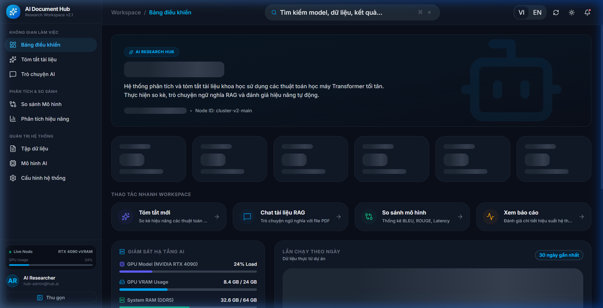
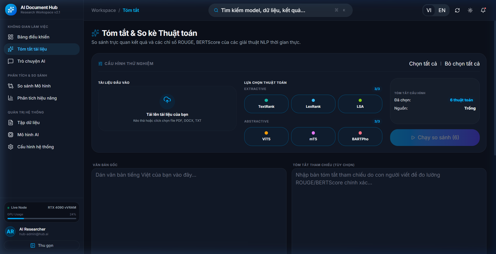
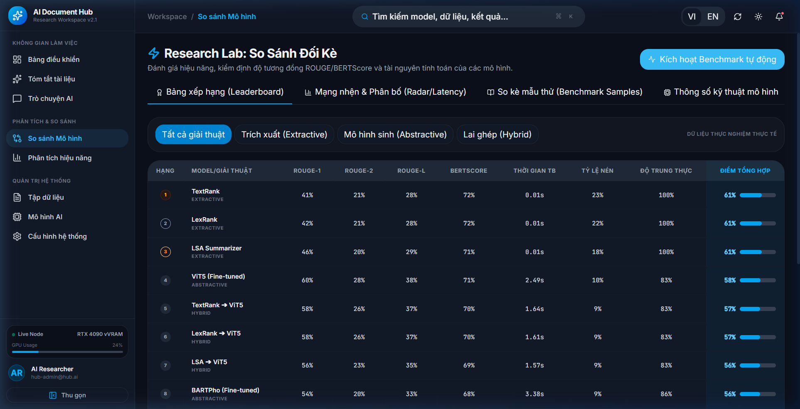
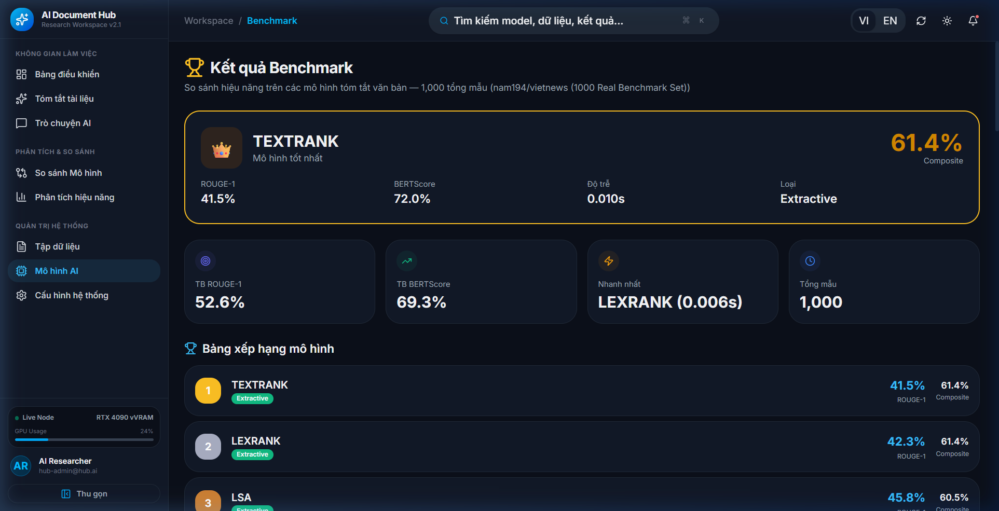
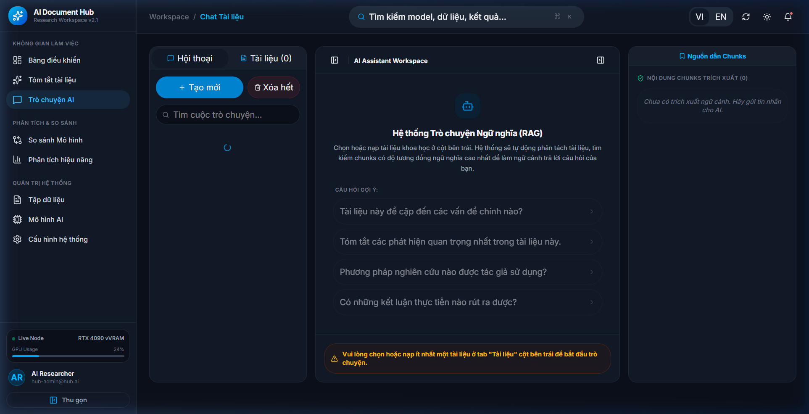
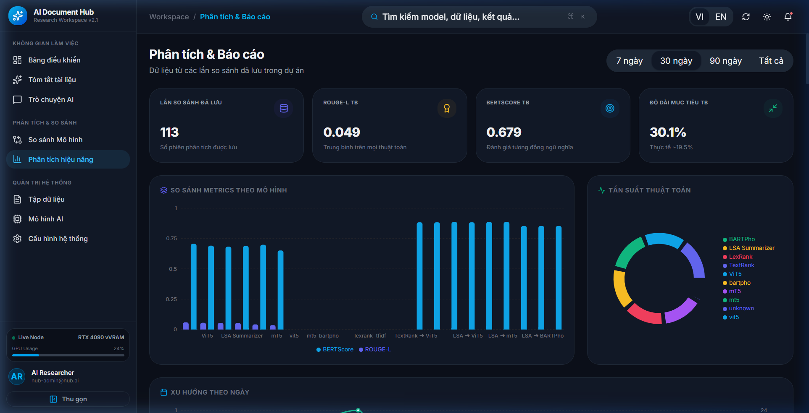
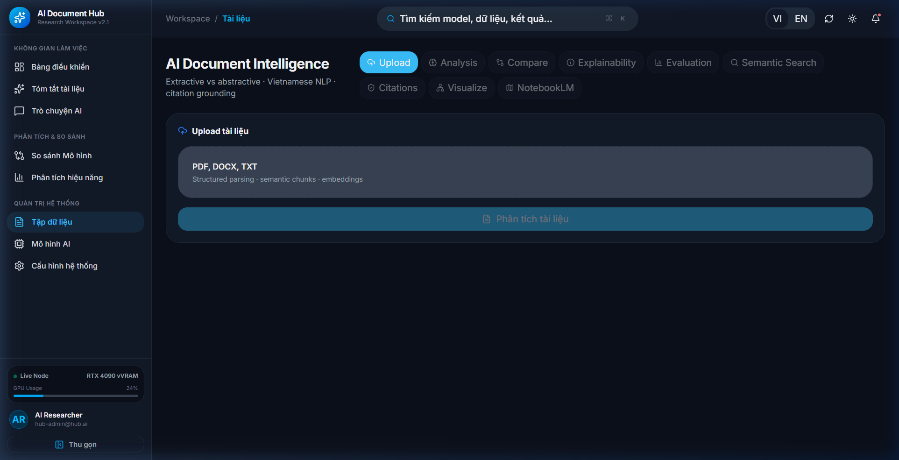
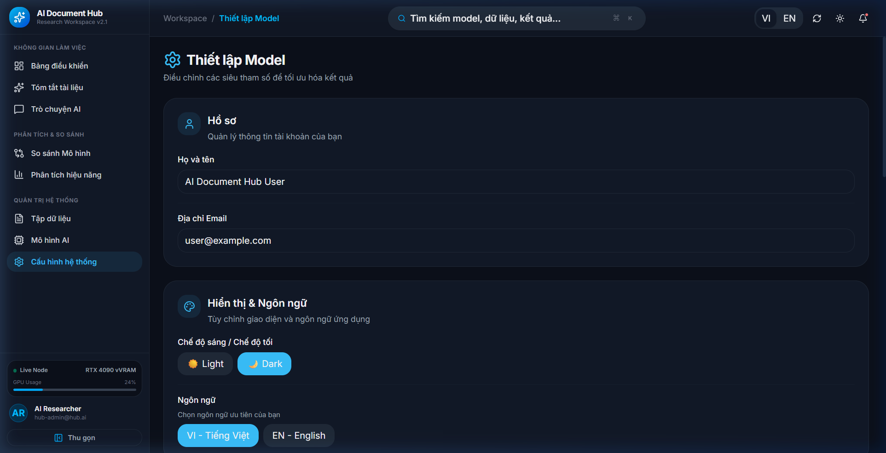

# Hệ Thống Tóm Tắt Văn Bản Tiếng Việt Đa Thuật Toán & Hỏi Đáp Tài Liệu (ChatRAG)

[](https://fastapi.tiangolo.com)
[](https://react.dev)
[](https://pytorch.org)
[](https://huggingface.co/docs/transformers)
[](https://qdrant.tech)
[](https://www.python.org)
[](https://www.docker.com)
[]()

Dự án nghiên cứu và triển khai hệ thống **tóm tắt văn bản tiếng Việt đa thuật toán** kết hợp **hỏi đáp trên tài liệu dài (RAG)**. Hệ thống so sánh các phương pháp trích xuất (Extractive), sinh văn bản (Abstractive) và pipeline lai (Hybrid), đồng thời cung cấp giao diện web để thử nghiệm, đánh giá và trực quan hóa kết quả.

**Phiên bản API:** `3.2.0` (theo `src/config.py`)

---

## 📌 Mục Lục

- [1. Tổng Quan Dự Án](#1-tổng-quan-dự-án)
- [2. Tính Năng Chính](#2-tính-năng-chính)
- [3. Kiến Trúc Hệ Thống](#3-kiến-trúc-hệ-thống)
- [4. Mô Hình & Thuật Toán Hỗ Trợ](#4-mô-hình--thuật-toán-hỗ-trợ)
- [5. Chỉ Số Đánh Giá (Evaluation Metrics)](#5-chỉ-số-đánh-giá-evaluation-metrics) — xem thêm [2.8.5 Đánh giá kết quả](docs/DANH_GIA_KET_QUA.md)
- [6. Công Thức Composite Score](#6-công-thức-composite-score)
- [7. Bộ Dữ Liệu (Dataset)](#7-bộ-dữ-liệu-dataset)
- [8. Kết Quả Benchmark](#8-kết-quả-benchmark)
- [9. So Sánh Mô Hình](#9-so-sánh-mô-hình)
- [10. Cài Đặt](#10-cài-đặt)
- [11. Hướng Dẫn Sử Dụng](#11-hướng-dẫn-sử-dụng)
- [12. Ảnh Chụp Màn Hình](#12-ảnh-chụp-màn-hình)
- [13. Cấu Trúc Dự Án](#13-cấu-trúc-dự-án)
- [14. Phân Tích Hiệu Năng](#14-phân-tích-hiệu-năng)
- [15. Đóng Góp Nghiên Cứu](#15-đóng-góp-nghiên-cứu)
- [16. Lộ Trình Phát Triển](#16-lộ-trình-phát-triển)
- [17. Tài Liệu API](#17-tài-liệu-api)

---

## 1. Tổng Quan Dự Án

### Mục tiêu nghiên cứu

- Xây dựng pipeline tóm tắt tiếng Việt **đa thuật toán**, cho phép so sánh công bằng giữa phương pháp cổ điển và mô hình Transformer Seq2Seq.
- Fine-tune và đánh giá các mô hình **ViT5**, **mT5**, **BARTPho** trên corpus tin tức tiếng Việt (`nam194/vietnews`).
- Thiết kế pipeline **Hybrid** (Extractive → Abstractive) nhằm giảm độ trễ và tránh tràn VRAM trên văn bản dài.
- Tích hợp module **RAG (Retrieval-Augmented Generation)** với hybrid search, reranking và chỉ mục phân cấp RAPTOR-lite cho hỏi đáp tài liệu.

### Bài toán giải quyết

| Bài toán | Mô tả |
|---|---|
| Tóm tắt đa thuật toán | So sánh 4 Extractive + 3 Abstractive + 9 Hybrid trên cùng văn bản |
| Đánh giá tự động | ROUGE, BLEU, BERTScore, Semantic Similarity, Faithfulness, Coverage |
| Tóm tắt tài liệu dài | Chunking song song, hybrid pipeline, kiểm soát độ dài đầu ra |
| Hỏi đáp tài liệu | Upload PDF/DOCX/TXT → embedding → retrieval → generation kèm trích dẫn |

---

## 2. Tính Năng Chính

| Tính năng | Trạng thái | Mô tả |
|:---|:---:|:---|
| 📄 Upload PDF / DOCX / TXT / MD | ✅ | Hỗ trợ qua `loaders/file_parser.py` và API `/summarize/files`, `/rag/documents/upload` |
| 🔀 So sánh đa mô hình | ✅ | Trang Compare + API `/summarize/compare`, `/research/compare/detailed` |
| 📊 Dashboard & Analytics | ✅ | Trang Analytics + API `/analytics/dashboard` |
| 🏆 Benchmark & Leaderboard | ✅ | Trang Benchmark + API `/research/leaderboard` (cần file kết quả thực nghiệm) |
| 💬 ChatRAG / Hỏi đáp tài liệu | ✅ | Trang Chat + API `/rag/chat`, `/rag/chat/stream` (SSE) |
| 🔍 Hybrid Search (BM25 + Vector) | ✅ | `backend/services/rag/retriever.py` — RRF fusion |
| 🎯 Cross-Encoder Reranking | ✅ | `BAAI/bge-reranker-v2-m3` |
| 🌲 RAPTOR-lite Indexing | ✅ | GMM clustering + tóm tắt đệ quy (`backend/services/rag/raptor.py`) |
| 🧠 Semantic Chunking | ✅ | Dynamic chunking theo embedding (`backend/services/rag/chunker.py`) |
| 📈 Explainability | ✅ | Trang Document Explainability + API explainability |
| 🐳 Docker Compose | ✅ | PostgreSQL, Redis, MinIO, Chroma, Qdrant, Celery |
| ⚡ Celery async jobs | ✅ | `/summarize` với `async_mode=true` |
| 🔬 Colab Training Notebooks | ✅ | 8 notebook fine-tune trên VietNews 30k, 3 epochs |

---

## 3. Kiến Trúc Hệ Thống

### 3.1 Pipeline Tóm Tắt & Đánh Giá

```
┌─────────────┐    ┌──────────────────┐    ┌─────────────────────┐    ┌──────────────┐    ┌─────────────┐
│  Document   │───▶│  Preprocessing   │───▶│   Summarization     │───▶│  Evaluation  │───▶│Visualization│
│ PDF/DOCX/TXT│    │ clean, tokenize  │    │ Extractive          │    │ ROUGE, BLEU  │    │ Dashboard   │
│  / Plaintext│    │ split sentences  │    │ Abstractive (Seq2Seq│    │ BERTScore    │    │ Compare UI  │
└─────────────┘    │ deduplicate      │    │ Hybrid (2-stage)    │    │ Faithfulness │    │ Benchmark   │
                   └──────────────────┘    └─────────────────────┘    │ Composite    │    └─────────────┘
                                                                       └──────────────┘
```

### 3.2 Pipeline RAG (ChatRAG)

```
┌──────────┐   ┌─────────────┐   ┌────────────────┐   ┌──────────────┐   ┌─────────────┐   ┌──────────┐
│  Upload  │──▶│  Chunking   │──▶│   Embedding    │──▶│  Vector DB   │──▶│  Retrieval  │──▶│ Generate │
│ Document │   │ Semantic /  │   │ PhoBERT-SimCSE │   │ Qdrant       │   │ BM25+Vector │   │ ViT5 /   │
│          │   │ Dynamic     │   │ (768-dim)      │   │ (+ Chroma)   │   │ → RRF       │   │ BARTPho  │
└──────────┘   └─────────────┘   └────────────────┘   └──────────────┘   │ → Reranker  │   │ + Citations│
                                                                          └─────────────┘   └──────────┘
       │
       └──▶ RAPTOR-lite (tùy chọn, RAG_USE_RAPTOR=1)
            GMM Cluster → Tóm tắt đệ quy → Cây phân cấp Level 0→N
```

### 3.3 Stack Công Nghệ

| Tầng | Công nghệ |
|---|---|
| Backend | FastAPI 0.110+, Uvicorn, Celery, SQLAlchemy |
| Frontend | React 19, Vite 7, Tailwind CSS 4, Zustand, Recharts |
| ML/NLP | PyTorch 2.1+, HuggingFace Transformers, Sentence-Transformers |
| Vector DB | Qdrant (mặc định), ChromaDB (tùy chọn) |
| Storage | PostgreSQL, Redis, MinIO, SQLite (local) |
| Evaluation | rouge-score, bert-score, custom metrics module |

---

## 4. Mô Hình & Thuật Toán Hỗ Trợ

> Nguồn: `ai_models/model_registry.py`, `configs/models.json`

### 4.1 Extractive (Trích xuất câu)

| Key | Tên | Loại | Mô tả |
|:---|:---|:---:|:---|
| `textrank` | TextRank | Graph-based | Xếp hạng câu theo centrality trên đồ thị tương đồng |
| `lexrank` | LexRank | Graph-based | Centrality với ngưỡng tương đồng câu |
| `lsa` | LSA Summarizer | Matrix factorization | SVD trên ma trận TF-IDF câu–từ |
| `tfidf` | TF-IDF Ranking | Lexical | Xếp hạng câu theo trọng số TF-IDF tổng hợp |

### 4.2 Abstractive (Sinh văn bản — Seq2Seq Transformer)

| Key | Tên | Base Model (HuggingFace) | Checkpoint Local | Fine-tuned |
|:---|:---|:---|:---|:---:|
| `vit5` | ViT5 | `VietAI/vit5-base` | `models/vit5-finetuned` | ✅ (Colab 30k, 3 epochs) |
| `mt5` | mT5 | `google/mt5-small` | `models/mt5-finetuned` | ✅ (Colab 30k, 3 epochs) |
| `bartpho` | BARTPho | `vinai/bartpho-syllable` | `models/bartpho-finetuned` | ✅ (Colab 30k, 3 epochs) |

**Cơ chế nạp model:** Ưu tiên checkpoint local nếu thư mục tồn tại và có file; ngược lại fallback về HuggingFace Hub (`resolve_model_path` trong `model_registry.py`).

**Prefix đầu vào:**
- ViT5, mT5: `"summarize: " + text`
- BARTPho: không prefix

### 4.3 Hybrid (Pipeline 2 giai đoạn)

| Key | Pipeline |
|:---|:---|
| `textrank-vit5` | TextRank → ViT5 |
| `lexrank-vit5` | LexRank → ViT5 |
| `lsa-vit5` | LSA → ViT5 |
| `textrank-mt5` | TextRank → mT5 |
| `lexrank-mt5` | LexRank → mT5 |
| `lsa-mt5` | LSA → mT5 |
| `textrank-bartpho` | TextRank → BARTPho |
| `lexrank-bartpho` | LexRank → BARTPho |
| `lsa-bartpho` | LSA → BARTPho |

**Giai đoạn 1:** Lọc câu quan trọng bằng thuật toán Extractive.  
**Giai đoạn 2:** Viết lại tóm tắt mượt bằng mô hình Abstractive (`pipeline/hybrid_summarizer.py`).

> **Lưu ý:** TF-IDF có trong registry API/UI nhưng **không** nằm trong script benchmark chính (`scripts/run_research_benchmark.py` — 15 cấu hình, không gồm `tfidf`).

---

## 5. Chỉ Số Đánh Giá (Evaluation Metrics)

> Nguồn: `evaluation/metrics.py`, `api/research.py` (`/research/metrics/explanation`)  
> **Tài liệu luận văn (mục 2.8.5):** [docs/DANH_GIA_KET_QUA.md](docs/DANH_GIA_KET_QUA.md)

| Metric | Ý nghĩa | Phạm vi | Cách hiểu |
|:---|:---|:---:|:---|
| **ROUGE-1** | Overlap unigram giữa tóm tắt và reference | 0–1 ↑ | Đo mức trùng khớp từ |
| **ROUGE-2** | Overlap bigram | 0–1 ↑ | Đo trùng khớp cụm từ |
| **ROUGE-L** | Longest Common Subsequence (LCS) F-score | 0–1 ↑ | Bảo toàn thứ tự từ |
| **ROUGE-Lsum** | ROUGE-L trên câu đã tách | 0–1 ↑ | Biến thể sentence-level |
| **BLEU** | N-gram precision có brevity penalty | 0–1 ↑ | Đo chất lượng dịch/sinh |
| **BERTScore F1** | F1 embedding contextual (`xlm-roberta-base`) | 0–1 ↑ | Tương đồng ngữ nghĩa sâu |
| **Semantic Similarity** | Cosine embedding (`paraphrase-multilingual-MiniLM-L12-v2`), chuẩn hóa [0,1] | 0–1 ↑ | Ý nghĩa tổng thể |
| **Faithfulness** | Trung bình max cosine (SBERT) giữa câu tóm tắt và câu nguồn | 0–1 ↑ | Mức bám sát nguồn (không dùng NLI) |
| **Coverage** | Tỷ lệ keyword nguồn xuất hiện trong tóm tắt | 0–1 ↑ | Độ phủ thông tin |
| **Compression Ratio** | `len(summary_words) / len(source_words)` | 0–1 ↓ | Mức nén văn bản |
| **Fluency** | `1 - redundancy_ratio` (từ `evaluation/readability.py`) | 0–1 ↑ | Độ trôi chảy (heuristic lặp từ; **không** dùng GPT-2 trong API) |
| **Hallucination audit** | Kiểm tra alignment câu–nguồn (`evaluation/hallucination.py`) | — | Phát hiện nội dung không grounded (RAG, khi bật `RAG_EVALUATE_HALLUCINATION`) |
| **GPT-2 Perplexity** | `NlpHUST/gpt2-vietnamese` → `exp(-loss/3)` | 0–1 ↑ | ⚠️ Chỉ trong script offline `scripts/run_research_benchmark.py` |

### Công thức ROUGE (tóm tắt)

```
Precision = |matched_ngrams| / |generated_ngrams|
Recall    = |matched_ngrams| / |reference_ngrams|
F-score   = 2 × P × R / (P + R)
```

### Công thức BLEU (trong code)

Modified n-gram precision (order 1–4) + brevity penalty, smoothing Laplace `(overlap+1)/(total+1)`.

### Công thức BERTScore

```
Precision = mean(max cosine(embed(pred_token), embed(ref_token)))
Recall    = mean(max cosine(embed(ref_token), embed(pred_token)))
F1        = 2 × P × R / (P + R)
```

Model mặc định: `xlm-roberta-base`, lang=`vi` (cấu hình trong `src/config.py`).

---

## 6. Công Thức Composite Score

> Nguồn: `evaluation/metrics.py` → `compute_composite_score()`, trọng số từ `src/config.py`

```
Composite = 0.25 × ROUGE-L
          + 0.25 × BERTScore F1
          + 0.20 × Semantic Similarity
          + 0.15 × Faithfulness
          + 0.10 × Coverage
          + 0.05 × Fluency
```

| Thành phần | Trọng số mặc định | Biến môi trường |
|:---|:---:|:---|
| ROUGE-L | 0.25 | `COMPOSITE_W_ROUGEL` |
| BERTScore | 0.25 | `COMPOSITE_W_BERTSCORE` |
| Semantic Similarity | 0.20 | `COMPOSITE_W_SEMANTIC` |
| Faithfulness | 0.15 | `COMPOSITE_W_FAITHFULNESS` |
| Coverage | 0.10 | `COMPOSITE_W_COVERAGE` |
| Fluency | 0.05 | `COMPOSITE_W_FLUENCY` |

Kết quả được clamp về `[0, 1]` và làm tròn 4 chữ số thập phân.

---

## 7. Bộ Dữ Liệu (Dataset)

### 7.1 Dataset chính — VietNews

| Thuộc tính | Giá trị (theo source code) |
|:---|:---|
| HuggingFace ID | `nam194/vietnews` |
| Cột nguồn | `article` |
| Cột reference | `abstract` (fallback: `title`) |
| Split benchmark | `test` (script `run_research_benchmark.py`) |
| Seed lấy mẫu | `42` |
| Cache local | `data/cache/` |

### 7.2 Cấu hình huấn luyện (Colab Notebooks)

| Tham số | Giá trị |
|:---|:---|
| Mẫu huấn luyện | 30.000 (`Colab_*_VietNews_30k_3Epochs.ipynb`) |
| Epochs | 3 |
| Max source tokens | 512 |
| Max target tokens | 128 |
| Batch size | 4 (grad accumulation 4) |
| Learning rate | 3e-5 (ViT5 notebook) |

### 7.3 Cấu hình mặc định API/Training local

| Tham số | Giá trị (`src/config.py`) |
|:---|:---|
| `MAX_TRAIN_SAMPLES` | 5000 |
| `VALIDATION_RATIO` | 0.1 |
| `DATASET_NAME` | `nam194/vietnews` |

### 7.4 Tiền xử lý

- Làm sạch văn bản (`src/preprocess.py`): chuẩn hóa Unicode, loại noise HTML, deduplicate
- Tokenization tiếng Việt: `underthesea`, `pyvi`
- Lọc mẫu không hợp lệ (article/summary rỗng, quá ngắn)

### 7.5 Phân loại độ dài văn bản (Benchmark)

| Category | Số từ (word count) |
|:---|:---|
| Short | 100 – 500 |
| Medium | 500 – 2.000 |
| Long | 2.000 – 10.000 |
| Very Long | 10.000 – 100.000 |

---

## 8. Kết Quả Benchmark

> ⚠️ **Chưa có dữ liệu xác minh trong source code.**  
> Thư mục `storage/` bị gitignore (`.gitignore`) và **không chứa file kết quả** trong repository. Các con số benchmark cần được tạo bằng cách chạy script thực nghiệm trên máy local.

### 8.1 Pipeline benchmark chính thức

Script: `scripts/run_research_benchmark.py`

| Tham số | Giá trị |
|:---|:---|
| Số mẫu mặc định | 1000 |
| Dataset | `nam194/vietnews` (split `test`) |
| Seed | 42 |
| Số cấu hình | 15 (3 Extractive + 3 Abstractive + 9 Hybrid) |
| Output JSON | `storage/results/benchmark_{N}_real.json` |
| Output CSV | `storage/results/benchmark_{N}_real.csv` |
| Leaderboard nhẹ | `storage/results/benchmark_leaderboard_only_{N}.json` |

### 8.2 Script benchmark bổ sung

| Script | Mục đích |
|:---|:---|
| `scripts/run_benchmarks.py` | Benchmark nhanh với mock/validation JSONL |
| `scripts/calculate_metrics_5000.py` | Tính ROUGE + BERTScore từ `benchmark_5000_real.json` |
| `src/benchmark.py` | So sánh Extractive vs Abstractive trên `thanhnew2001/vnexpress` |
| `scripts/evaluate_rag_system.py` | Đánh giá hệ thống RAG |

### 8.3 Chạy benchmark để tạo kết quả

```powershell
# Kích hoạt môi trường
python -m venv venv
venv\Scripts\activate
pip install -r requirements.txt

# Fine-tuned models cần có trong models/*-finetuned/
python scripts/run_research_benchmark.py --samples 1000

# Tính metrics cho bộ 5000 mẫu (nếu đã có file JSON)
python scripts/calculate_metrics_5000.py
```

### 8.4 Dữ liệu dự phòng trong API (không phải kết quả thực nghiệm đã commit)

Khi file benchmark không tồn tại, `api/research.py` sử dụng `FALLBACK_LEADERBOARD` để UI vẫn hiển thị được. **Đây là dữ liệu hardcode phục vụ demo, không thay thế kết quả thực nghiệm.**

---

## 9. So Sánh Mô Hình

Hệ thống hỗ trợ so sánh qua:

| Kênh | Endpoint / Trang |
|:---|:---|
| Web UI | `/compare` — so sánh trực quan đa thuật toán |
| API đồng bộ | `POST /summarize/compare` |
| API streaming | `POST /summarize/compare/stream` (SSE) |
| API nghiên cứu | `POST /research/compare/detailed` |
| Leaderboard | `GET /research/leaderboard?size=1000` |
| Theo category | `GET /research/leaderboard/by-category?category=Medium` |

**Tiêu chí xếp hạng:** Composite Score (mục 6) khi có reference summary; nếu không có reference, hệ thống dùng trọng số `NO_REFERENCE_RANKING_WEIGHTS` (BERTScore 0.45, Semantic 0.35, Compression 0.20).

---

## 10. Cài Đặt

### 10.1 Yêu cầu hệ thống

| Thành phần | Phiên bản |
|:---|:---|
| Python | 3.11.x (Dockerfile dùng 3.11-slim) |
| Node.js | LTS (khuyến nghị 20+) |
| GPU | Tùy chọn — NVIDIA CUDA (PyTorch cu124) |
| VRAM khuyến nghị | ≥ 4 GB (code có tối ưu cho RTX 3050 Ti 4GB) |

### 10.2 Cài đặt Backend (Windows PowerShell)

```powershell
git clone https://github.com/tuilatoan15/NLP-Text-Summarization-Transformer-System.git
cd NLP-Text-Summarization-Transformer-System

python -m venv venv
venv\Scripts\activate
pip install --no-cache-dir -r requirements.txt

# GPU NVIDIA (tùy chọn)
pip install torch torchvision torchaudio --index-url https://download.pytorch.org/whl/cu124

# Cấu hình môi trường
copy .env.example .env
# Chỉnh sửa .env theo nhu cầu
```

### 10.3 Cài đặt Frontend

```powershell
cd frontend
npm install
npm run dev
```

### 10.4 Khởi chạy nhanh (Windows)

```powershell
.\run_project.bat
```

- Backend: `http://localhost:8000`
- Frontend: `http://localhost:5173`
- Swagger: `http://localhost:8000/docs`

### 10.5 Docker Compose

```bash
docker-compose up -d --build
```

| Dịch vụ | Port |
|:---|:---|
| API | 8000 |
| Frontend (Vite dev) | 5173 |
| PostgreSQL | 5432 |
| Redis | 6379 |
| MinIO | 9000 / Console 9001 |
| Chroma | 8001 |
| Qdrant Dashboard | 6333 |

### 10.6 Fine-tuned Models

Checkpoint cần đặt tại:

```
models/vit5-finetuned/
models/mt5-finetuned/
models/bartpho-finetuned/
```

Huấn luyện qua Colab notebooks trong `notebooks/` hoặc:

```powershell
python scripts/train.py --model vit5
python train/train_vit5.py --max_samples 5000
```

---

## 11. Hướng Dẫn Sử Dụng

### 11.1 Tóm tắt văn bản

```bash
curl -X POST http://localhost:8000/summarize/compare \
  -H "Content-Type: application/json" \
  -d '{
    "text": "Đoạn văn bản tiếng Việt cần tóm tắt...",
    "reference": "Tóm tắt tham chiếu (tùy chọn)",
    "algorithms": ["textrank", "vit5", "textrank-vit5"],
    "extractive_sentences": 5,
    "max_abstractive_length": 200
  }'
```

### 11.2 Upload file và tóm tắt

```bash
curl -X POST http://localhost:8000/summarize/files/compare \
  -F "file=@document.pdf" \
  -F "algorithms=textrank,vit5,lexrank-vit5"
```

Định dạng hỗ trợ: `.txt`, `.pdf`, `.docx`, `.md`

### 11.3 Hỏi đáp RAG (streaming)

```bash
# Upload tài liệu
curl -X POST http://localhost:8000/rag/documents/upload \
  -F "file=@report.pdf"

# Chat streaming (SSE)
curl -X POST http://localhost:8000/rag/chat/stream \
  -H "Content-Type: application/json" \
  -d '{
    "query": "Nội dung chính của tài liệu là gì?",
    "document_ids": ["<document_id>"],
    "use_reranking": true,
    "retrieval_mode": "hybrid"
  }'
```

### 11.4 Xem Leaderboard

```bash
curl http://localhost:8000/research/leaderboard?size=1000
```

### 11.5 Chạy benchmark nghiên cứu

```powershell
python scripts/run_research_benchmark.py --samples 1000 --output-dir storage/results
```

---

## 12. Ảnh Chụp Màn Hình

> Ảnh thực tế lưu tại `docs/screenshots/`

### Dashboard (Overview)



### Tóm tắt văn bản (Summarize)



### So sánh mô hình (Compare)



### Benchmark & Leaderboard



### ChatRAG



### Analytics



### Quản lý tài liệu



### Cài đặt hệ thống



> Phiên bản light mode: `docs/screenshots/light/`

---

## 13. Cấu Trúc Dự Án

```
NLP-Text-Summarization-Transformer-System/
├── ai_models/                  # Registry & model loader (GPU preload)
├── api/                        # FastAPI routers
│   ├── main.py                 # /summarize, /health, /analytics
│   ├── document_chat.py        # /rag/* — ChatRAG endpoints
│   ├── document_intelligence.py# Document intelligence pipeline
│   ├── chat.py                 # /api/chat/* — Conversation history
│   └── research.py             # /research/* — Benchmark & leaderboard
├── backend/
│   ├── services/rag/           # RAG: chunker, retriever, reranker, raptor, generator
│   ├── services/               # Analytics, dashboard, document services
│   └── db/                     # Repository layer
├── configs/                    # models.json, ingest.json
├── docs/
│   └── screenshots/            # UI screenshots
├── evaluation/                 # metrics.py, hallucination.py, readability.py
├── frontend/                   # React + Vite SPA
│   └── src/pages/              # Overview, Compare, Benchmark, Chat, Analytics...
├── loaders/                    # PDF, DOCX, TXT parsers
├── models/                     # Fine-tuned checkpoints (gitignored contents)
├── notebooks/                  # Colab training notebooks (ViT5, mT5, BARTPho)
├── pipeline/                   # hybrid_summarizer.py
├── scripts/                    # Benchmark, train, evaluate, ingest scripts
├── src/                        # Core: config, preprocess, dashboard, benchmark
├── summarizers/
│   ├── extractive/             # TextRank, LexRank, LSA, TF-IDF
│   └── abstractive/            # ViT5, mT5, BARTPho wrappers
├── tests/                      # pytest test suite
├── train/                      # Dataset loader, training scripts
├── workers/                    # Celery tasks
├── storage/                    # Results, uploads (gitignored)
├── docker-compose.yml
├── Dockerfile
├── requirements.txt
└── run_project.bat
```

---

## 14. Phân Tích Hiệu Năng

> **Chưa có dữ liệu xác minh trong source code** cho bảng số liệu hiệu năng cụ thể. Dưới đây là các cơ chế tối ưu **đã triển khai trong code**:

| Cơ chế | File / Config | Mục đích |
|:---|:---|:---|
| Model preload at startup | `api/main.py` lifespan, `PRELOAD_MODELS=1` | Giảm cold-start latency |
| Parallel extractive | `EXTRACTIVE_WORKERS=4` | TextRank/LexRank/LSA song song |
| Chunk parallel inference | `ABSTRACTIVE_CHUNK_WORKERS=2` | Abstractive trên văn bản dài |
| GPU cooldown | `run_research_benchmark.py` | Nghỉ 5 phút mỗi 1 giờ chạy liên tục |
| FP16 auto | `USE_FP16=auto` | Giảm VRAM trên GPU Turing+ |
| Heavy metrics timeout | `HEAVY_METRICS_TIMEOUT=30s` | Tránh treo BERTScore |
| Hybrid pipeline | `pipeline/hybrid_summarizer.py` | Giảm input tokens → Abstractive |
| RAG batch rerank | `rag_config.py` | Top-30 → rerank → top-4 chunks |

---

## 15. Đóng Góp Nghiên Cứu

1. **Framework so sánh đa thuật toán tiếng Việt** — 16 thuật toán (4 Extractive + 3 Abstractive + 9 Hybrid) với API và UI thống nhất.
2. **Pipeline Hybrid 2 giai đoạn** — Kết hợp lọc câu Extractive và viết lại Abstractive, hỗ trợ semantic chunking tùy chọn.
3. **Bộ metrics đa chiều** — ROUGE, BLEU, BERTScore, Semantic Similarity, Faithfulness, Coverage, Composite Score có trọng số cấu hình được.
4. **Benchmark pipeline tự động** — Script chạy 15 cấu hình trên VietNews test set, phân loại Short/Medium/Long/Very Long, xuất JSON/CSV.
5. **ChatRAG nâng cao** — Hybrid BM25+Vector (RRF), Cross-Encoder reranking, RAPTOR-lite GMM tree, trích dẫn nguồn.
6. **Colab notebooks chuẩn hóa** — Fine-tune ViT5/mT5/BARTPho trên 30k mẫu VietNews, 3 epochs, có checkpoint recovery.
7. **Document Intelligence** — Ingest PDF/DOCX, hierarchical summarization, explainability, report export.

---

## 16. Lộ Trình Phát Triển

Các hạng mục **chưa triển khai** hoặc còn hạn chế (xác minh từ source code):

| Hạng mục | Trạng thái |
|:---|:---|
| Commit file benchmark thực nghiệm vào repo | ❌ `storage/` gitignored, chưa có số liệu |
| Human evaluation (đánh giá thủ công) | ⚠️ Có trường `human_eval_ready` trong metrics, chưa có workflow UI |
| mT5 chất lượng tiếng Việt ổn định | ⚠️ `MT5_EXPERIMENTAL=1`, cảnh báo latin ratio |
| TTS Podcast export | ⚠️ API tồn tại (`/document-intelligence/.../podcast/tts`), gTTS commented out |
| FAISS / LangChain integration | ❌ Commented trong requirements.txt |
| Frontend Documents page | ⚠️ Route tồn tại nhưng ẩn trong Sidebar |
| Multi-GPU training | ❌ Chưa hỗ trợ |
| Online learning / continual fine-tune | ❌ Chưa có |

---

## 17. Tài Liệu API

### Endpoints chính

| Method | Endpoint | Mô tả |
|:---|:---|:---|
| GET | `/health` | Trạng thái GPU, VRAM, models loaded |
| GET | `/models` | Danh sách thuật toán |
| POST | `/summarize` | Tóm tắt đơn |
| POST | `/summarize/compare` | So sánh đa thuật toán |
| POST | `/summarize/files` | Tóm tắt từ file upload |
| POST | `/rag/documents/upload` | Upload tài liệu RAG |
| POST | `/rag/chat/stream` | Hỏi đáp streaming (SSE) |
| GET | `/research/leaderboard` | Bảng xếp hạng benchmark |
| POST | `/research/benchmark/run` | Kích hoạt benchmark (background) |
| GET | `/analytics/dashboard` | Dashboard analytics |

**Swagger UI:** [http://localhost:8000/docs](http://localhost:8000/docs)

---

## 📄 Giấy Phép & Liên Hệ

Dự án phục vụ mục đích nghiên cứu luận văn tốt nghiệp. Vui lòng trích dẫn khi sử dụng.

**Repository:** [github.com/tuilatoan15/NLP-Text-Summarization-Transformer-System](https://github.com/tuilatoan15/NLP-Text-Summarization-Transformer-System)
