# Vietnamese Text Summarization & Document Q&A System

[](https://fastapi.tiangolo.com)
[](https://react.dev)
[](https://pytorch.org)
[](https://huggingface.co/docs/transformers)
[](https://qdrant.tech)
[](https://www.python.org)
[](https://www.docker.com)
[](LICENSE)

A multi-algorithm **Vietnamese text summarization** system with **Retrieval-Augmented Generation (RAG)** for document question answering. The system compares Extractive, Abstractive (Seq2Seq Transformer), and Hybrid summarization approaches, with a web interface for experimentation, evaluation, and visualization.

> **Hệ thống tóm tắt văn bản tiếng Việt đa thuật toán** kết hợp **hỏi đáp tài liệu dài (ChatRAG)**. So sánh phương pháp trích xuất (Extractive), sinh văn bản (Abstractive) và pipeline lai (Hybrid), cung cấp giao diện web để thử nghiệm, đánh giá và trực quan hóa kết quả.

**API Version:** `3.2.0`

📺 **Demo:** [Google Drive](https://drive.google.com/drive/folders/1vqYw1rEsb3PA5w8WEal_L_Yuf9LvM2zl?usp=sharing)

---

## Table of Contents

- [Features](#features)
- [System Architecture](#system-architecture)
- [Technology Stack](#technology-stack)
- [Models & Algorithms](#models--algorithms)
- [Folder Structure](#folder-structure)
- [Installation](#installation)
- [Running](#running)
- [API Reference](#api-reference)
- [RAG Pipeline](#rag-pipeline)
- [Evaluation Metrics](#evaluation-metrics)
- [Benchmark](#benchmark)
- [Screenshots](#screenshots)
- [Future Work](#future-work)
- [License](#license)
- [Authors](#authors)
- [Citation](#citation)

---

## Features

| Feature | Description |
|:---|:---|
| 📄 Multi-format Upload | PDF, DOCX, TXT, Markdown file parsing with OCR support |
| 🔀 Multi-algorithm Comparison | Side-by-side comparison of 16 summarization algorithms |
| 🧠 Fine-tuned Transformer Models | ViT5, mT5, BARTPho fine-tuned on 30k Vietnamese news samples |
| 🔗 Hybrid Pipeline | Two-stage Extractive → Abstractive summarization for long documents |
| 💬 ChatRAG | Document Q&A with hybrid search, reranking, and source citations |
| 🔍 Hybrid Search | BM25 + Vector search with Reciprocal Rank Fusion (RRF) |
| 🎯 Cross-Encoder Reranking | BAAI/bge-reranker-v2-m3 for precision retrieval |
| 🌲 RAPTOR-lite Indexing | GMM clustering + recursive summarization for hierarchical retrieval |
| 📊 Dashboard & Analytics | Real-time metrics visualization, model comparison charts |
| 🏆 Benchmark & Leaderboard | Automated benchmarking on VietNews dataset with ranking |
| 📈 Explainability | Sentence-level attribution and document intelligence |
| ⚡ Async Processing | Celery workers for background summarization tasks |
| 🐳 Docker Compose | Full-stack deployment with PostgreSQL, Redis, MinIO, Qdrant |
| 🔬 Colab Notebooks | 8 training notebooks for fine-tuning on Google Colab |

---

## System Architecture

### Summarization & Evaluation Pipeline

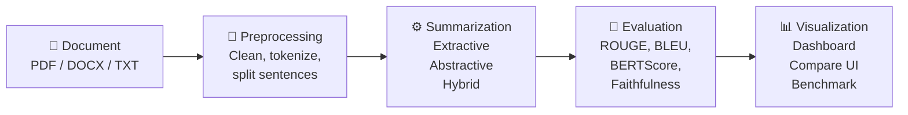

### RAG Pipeline (ChatRAG)

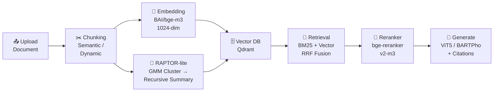

### Full Stack Overview

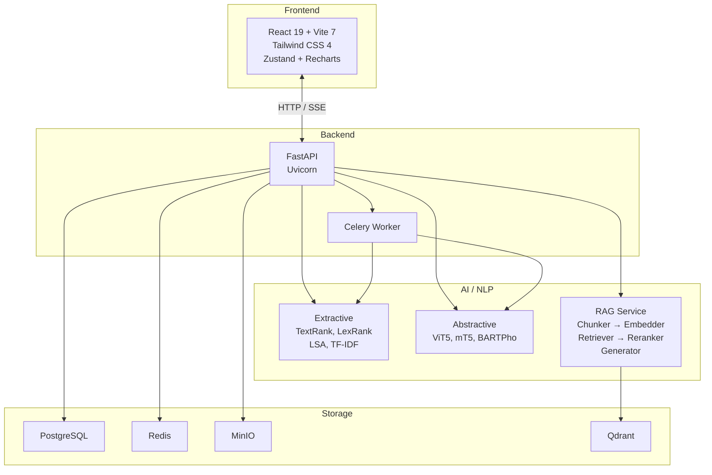

---

## Technology Stack

| Layer | Technologies |
|:---|:---|
| **Backend** | FastAPI 0.110+, Uvicorn, Celery, SQLAlchemy, asyncpg |
| **Frontend** | React 19, Vite 7, Tailwind CSS 4, Zustand, Recharts, Framer Motion |
| **AI / NLP** | PyTorch 2.1+, HuggingFace Transformers 4.38+, Sentence-Transformers 3.0+ |
| **Embedding** | BAAI/bge-m3 (1024-dim), PhoBERT-SimCSE |
| **Reranker** | BAAI/bge-reranker-v2-m3 |
| **Vector DB** | Qdrant (default), ChromaDB (optional) |
| **Database** | PostgreSQL 16, SQLite (local fallback) |
| **Cache** | Redis 7 |
| **Object Storage** | MinIO |
| **Evaluation** | rouge-score, bert-score, sentence-transformers |
| **Vietnamese NLP** | underthesea, pyvi |
| **OCR** | Tesseract, EasyOCR |
| **Containerization** | Docker, Docker Compose |

---

## Models & Algorithms

### Extractive (Sentence Ranking)

| Key | Algorithm | Type | Description |
|:---|:---|:---:|:---|
| `textrank` | TextRank | Graph-based | Sentence centrality on similarity graph |
| `lexrank` | LexRank | Graph-based | Thresholded sentence similarity centrality |
| `lsa` | LSA Summarizer | Matrix factorization | SVD on TF-IDF sentence-term matrix |
| `tfidf` | TF-IDF Ranking | Lexical | Aggregate TF-IDF sentence scoring |

### Abstractive (Seq2Seq Transformer)

| Key | Model | Base (HuggingFace) | Fine-tuned |
|:---|:---|:---|:---:|
| `vit5` | ViT5 | `VietAI/vit5-base` | ✅ 30k samples, 3 epochs |
| `mt5` | mT5 | `google/mt5-small` | ✅ 30k samples, 3 epochs |
| `bartpho` | BARTPho | `vinai/bartpho-syllable` | ✅ 30k samples, 3 epochs |

Fine-tuned checkpoints are stored in `models/*-finetuned/`. The system falls back to HuggingFace Hub if local checkpoints are not found.

### Hybrid (Two-stage Pipeline)

Combines Extractive sentence filtering (stage 1) with Abstractive rewriting (stage 2):

| Pipeline | Stage 1 → Stage 2 |
|:---|:---|
| `textrank-vit5` | TextRank → ViT5 |
| `lexrank-vit5` | LexRank → ViT5 |
| `lsa-vit5` | LSA → ViT5 |
| `textrank-mt5` | TextRank → mT5 |
| `lexrank-mt5` | LexRank → mT5 |
| `lsa-mt5` | LSA → mT5 |
| `textrank-bartpho` | TextRank → BARTPho |
| `lexrank-bartpho` | LexRank → BARTPho |
| `lsa-bartpho` | LSA → BARTPho |

---

## Folder Structure

```
NLP-Text-Summarization-Transformer-System/
├── ai_models/                  # Model registry & GPU model loader
│   ├── model_registry.py       # Algorithm registry & resolve_model_path
│   └── model_loader.py         # Lazy loading with VRAM management
├── api/                        # FastAPI routers
│   ├── main.py                 # /summarize, /health, /analytics endpoints
│   ├── document_chat.py        # /rag/* — ChatRAG endpoints
│   ├── document_intelligence.py # Document intelligence pipeline
│   ├── chat.py                 # /api/chat/* — Conversation history
│   └── research.py             # /research/* — Benchmark & leaderboard
├── backend/
│   ├── app/                    # FastAPI app factory
│   ├── core/                   # Settings & configuration
│   ├── db/                     # Repository layer (SQLAlchemy)
│   └── services/
│       ├── rag/                # Full RAG pipeline
│       │   ├── chunker.py      # Semantic / dynamic chunking
│       │   ├── retriever.py    # BM25 + Vector hybrid search (RRF)
│       │   ├── reranker.py     # Cross-encoder reranking
│       │   ├── generator.py    # Response generation with citations
│       │   ├── raptor.py       # RAPTOR-lite hierarchical indexing
│       │   └── ...             # Cache, agent, config, vector store
│       ├── dashboard_service.py
│       ├── analytics_service.py
│       └── document_intelligence_service.py
├── configs/                    # models.json, ingest.json
├── datasets/                   # Dataset scripts
├── docs/
│   ├── screenshots/light/      # UI screenshots (light mode)
│   ├── flowcharts/             # System diagrams
│   └── DATABASE_SCHEMA.sql     # PostgreSQL schema
├── embeddings/                 # Embedding service & vector store
├── evaluation/                 # Metrics computation
│   ├── metrics.py              # ROUGE, BLEU, BERTScore, Composite Score
│   ├── hallucination.py        # Hallucination detection
│   ├── fact_check.py           # Fact verification
│   └── readability.py          # Fluency scoring
├── frontend/                   # React + Vite SPA
│   └── src/
│       ├── pages/              # Overview, Playground, Compare, Benchmark,
│       │                       # Chat, Analytics, DatasetAnalytics, Settings
│       ├── components/         # Reusable UI components
│       ├── services/           # API client
│       ├── stores/             # Zustand state management
│       └── i18n/               # Internationalization (VI/EN)
├── loaders/                    # File parsers (PDF, DOCX, TXT, OCR)
├── models/                     # Fine-tuned model checkpoints (gitignored)
├── notebooks/                  # Colab training notebooks (8 notebooks)
├── optimization/               # Model quantization (4-bit, 8-bit)
├── pipeline/                   # Hybrid summarizer, ingest pipeline, schema
├── preprocess/                 # Text cleaning, tokenization, chunking
├── scripts/                    # Benchmark, training, evaluation scripts
├── src/                        # Core config, preprocessing, Celery app
├── summarizers/
│   ├── extractive/             # TextRank, LexRank, LSA, TF-IDF
│   └── abstractive/            # ViT5, mT5, BARTPho wrappers
├── tests/                      # pytest test suite (33 test files)
├── train/                      # Dataset loader, training scripts
├── utils/                      # Logger, metrics helpers
├── visualization/              # Charts, embeddings viz, explainability
├── workers/                    # Celery async tasks
├── docker-compose.yml          # 8 services orchestration
├── Dockerfile                  # Python 3.11-slim based
├── requirements.txt            # Python dependencies
├── .env.example                # Environment variable template
└── run_project.bat             # Quick-start script (Windows)
```

---

## Installation

### Prerequisites

| Requirement | Version |
|:---|:---|
| Python | 3.11.x |
| Node.js | 20+ LTS |
| GPU (optional) | NVIDIA CUDA (PyTorch cu124), ≥ 4 GB VRAM recommended |

### Backend Setup

```bash
git clone https://github.com/tuilatoan15/NLP-Text-Summarization-Transformer-System.git
cd NLP-Text-Summarization-Transformer-System

python -m venv venv

# Linux / macOS
source venv/bin/activate

# Windows PowerShell
venv\Scripts\activate

pip install --no-cache-dir -r requirements.txt
```

**GPU support (optional):**

```bash
pip install torch torchvision torchaudio --index-url https://download.pytorch.org/whl/cu124
```

### Frontend Setup

```bash
cd frontend
npm install
```

### Environment Configuration

```bash
cp .env.example .env
# Edit .env to match your setup
```

Key environment variables:

| Variable | Default | Description |
|:---|:---|:---|
| `API_PORT` | `8000` | Backend API port |
| `PRELOAD_MODELS` | `0` | Preload models at startup |
| `FORCE_CPU` | `0` | Force CPU inference (no GPU) |
| `VECTOR_BACKEND` | `local` | Vector store backend (`qdrant` / `local`) |
| `DATABASE_URL` | — | PostgreSQL connection string |
| `REDIS_URL` | — | Redis connection string |
| `RAG_USE_RAPTOR` | `1` | Enable RAPTOR-lite hierarchical indexing |

See [.env.example](.env.example) for the full list of configuration options.

### Fine-tuned Model Checkpoints

Place fine-tuned checkpoints in the following directories:

```
models/vit5-finetuned/
models/mt5-finetuned/
models/bartpho-finetuned/
```

Train via Colab notebooks in `notebooks/` or locally:

```bash
python scripts/train.py --model vit5
python train/train_vit5.py --max_samples 5000
```

---

## Running

### Local Development

**Quick start (Windows):**

```powershell
.\run_project.bat
```

**Manual start:**

```bash
# Terminal 1 — Backend
python -m api.main

# Terminal 2 — Frontend
cd frontend
npm run dev
```

| Service | URL |
|:---|:---|
| Backend API | http://localhost:8000 |
| Frontend | http://localhost:5173 |
| Swagger UI | http://localhost:8000/docs |

### Docker Compose

```bash
docker-compose up -d --build
```

| Service | Port | Description |
|:---|:---:|:---|
| API | 8000 | FastAPI backend |
| Frontend | 5173 | Vite dev server |
| PostgreSQL | 5432 | Primary database |
| Redis | 6379 | Cache & Celery broker |
| MinIO | 9000 / 9001 | Object storage / Console |
| ChromaDB | 8001 | Vector store (optional) |
| Qdrant | 6333 | Vector store (default) |

---

## API Reference

### Core Endpoints

| Method | Endpoint | Description |
|:---|:---|:---|
| `GET` | `/health` | System health (GPU, VRAM, loaded models) |
| `GET` | `/models` | List available algorithms |
| `POST` | `/summarize` | Single-algorithm summarization |
| `POST` | `/summarize/compare` | Multi-algorithm comparison |
| `POST` | `/summarize/compare/stream` | Streaming comparison (SSE) |
| `POST` | `/summarize/files` | Summarize uploaded file |

### RAG Endpoints

| Method | Endpoint | Description |
|:---|:---|:---|
| `POST` | `/rag/documents/upload` | Upload document for RAG |
| `POST` | `/rag/chat` | Document Q&A |
| `POST` | `/rag/chat/stream` | Streaming Q&A (SSE) |

### Research Endpoints

| Method | Endpoint | Description |
|:---|:---|:---|
| `GET` | `/research/leaderboard` | Benchmark leaderboard |
| `GET` | `/research/leaderboard/by-category` | Leaderboard by document length |
| `POST` | `/research/benchmark/run` | Trigger benchmark (background) |
| `POST` | `/research/compare/detailed` | Detailed algorithm comparison |

### Analytics Endpoints

| Method | Endpoint | Description |
|:---|:---|:---|
| `GET` | `/analytics/dashboard` | Dashboard metrics |
| `GET` | `/analytics/trends` | Usage trends |

**Interactive API docs:** [http://localhost:8000/docs](http://localhost:8000/docs)

---

## RAG Pipeline

The Retrieval-Augmented Generation pipeline for document question answering:

```
┌──────────┐   ┌─────────────┐   ┌────────────────┐   ┌──────────────┐
│  Upload  │──▶│  Chunking   │──▶│   Embedding    │──▶│  Vector DB   │
│ Document │   │ Semantic /  │   │ BAAI/bge-m3    │   │ Qdrant       │
│ PDF/DOCX │   │ Dynamic     │   │ (1024-dim)     │   │              │
└──────────┘   └─────────────┘   └────────────────┘   └──────┬───────┘
                     │                                        │
                     ▼                                        ▼
              ┌─────────────┐                          ┌─────────────┐
              │ RAPTOR-lite │                          │  Retrieval  │
              │ GMM Cluster │                          │ BM25+Vector │
              │ → Recursive │                          │ → RRF Merge │
              │   Summary   │                          │ → Reranker  │
              └─────────────┘                          └──────┬──────┘
                                                              │
                                                              ▼
                                                       ┌──────────────┐
                                                       │   Generate   │
                                                       │ ViT5/BARTPho │
                                                       │ + Citations  │
                                                       └──────────────┘
```

### Pipeline Steps

1. **Upload** — Parse PDF, DOCX, or TXT documents using specialized loaders with OCR fallback
2. **Chunking** — Split documents into semantic chunks based on embedding similarity boundaries
3. **Embedding** — Encode chunks using BAAI/bge-m3 (1024 dimensions)
4. **Indexing** — Store embeddings in Qdrant vector database
5. **RAPTOR-lite** (optional) — Build hierarchical index via GMM clustering and recursive summarization
6. **Retrieval** — Hybrid search combining BM25 lexical matching and vector similarity, merged via Reciprocal Rank Fusion
7. **Reranking** — Cross-encoder reranking with BAAI/bge-reranker-v2-m3 for precision
8. **Generation** — Produce answers using ViT5 or BARTPho with source chunk citations

---

## Evaluation Metrics

The system computes the following metrics when a reference summary is available:

| Metric | Range | Description |
|:---|:---:|:---|
| **ROUGE-1** | 0–1 ↑ | Unigram overlap between summary and reference |
| **ROUGE-2** | 0–1 ↑ | Bigram overlap |
| **ROUGE-L** | 0–1 ↑ | Longest Common Subsequence F-score |
| **BLEU** | 0–1 ↑ | N-gram precision with brevity penalty |
| **BERTScore F1** | 0–1 ↑ | Contextual embedding similarity (`xlm-roberta-base`) |
| **Semantic Similarity** | 0–1 ↑ | Cosine similarity via `paraphrase-multilingual-MiniLM-L12-v2` |
| **Faithfulness** | 0–1 ↑ | Max cosine between summary and source sentences (SBERT) |
| **Coverage** | 0–1 ↑ | Source keyword presence ratio in summary |
| **Compression Ratio** | 0–1 ↓ | `len(summary) / len(source)` |
| **Fluency** | 0–1 ↑ | `1 - redundancy_ratio` (word repetition heuristic) |

### Composite Score

The final ranking metric combines multiple dimensions:

```
Composite = 0.25 × ROUGE-L
          + 0.25 × BERTScore F1
          + 0.20 × Semantic Similarity
          + 0.15 × Faithfulness
          + 0.10 × Coverage
          + 0.05 × Fluency
```

Weights are configurable via environment variables (`COMPOSITE_W_ROUGEL`, `COMPOSITE_W_BERTSCORE`, etc.).

---

## Benchmark

### Dataset

| Property | Value |
|:---|:---|
| Dataset | [`nam194/vietnews`](https://huggingface.co/datasets/nam194/vietnews) |
| Source column | `article` |
| Reference column | `abstract` |
| Split | `test` |
| Seed | `42` |

### Document Length Categories

| Category | Word Count |
|:---|:---|
| Short | 100 – 500 |
| Medium | 500 – 2,000 |
| Long | 2,000 – 10,000 |
| Very Long | 10,000 – 100,000 |

### Running Benchmarks

```bash
# Run benchmark on 1000 samples
python scripts/run_research_benchmark.py --samples 1000

# Results are saved to:
# storage/results/benchmark_1000_real.json
# storage/results/benchmark_1000_real.csv
```

The benchmark evaluates 15 configurations (3 Extractive + 3 Abstractive + 9 Hybrid) across all document length categories.

### Training Configuration (Colab)

| Parameter | Value |
|:---|:---|
| Training samples | 30,000 |
| Epochs | 3 |
| Max source tokens | 512 |
| Max target tokens | 128 |
| Batch size | 4 (gradient accumulation 4) |
| Learning rate | 3e-5 |

---

## Screenshots

> All screenshots are captured in **Light Mode** to ensure clarity.

### Dashboard

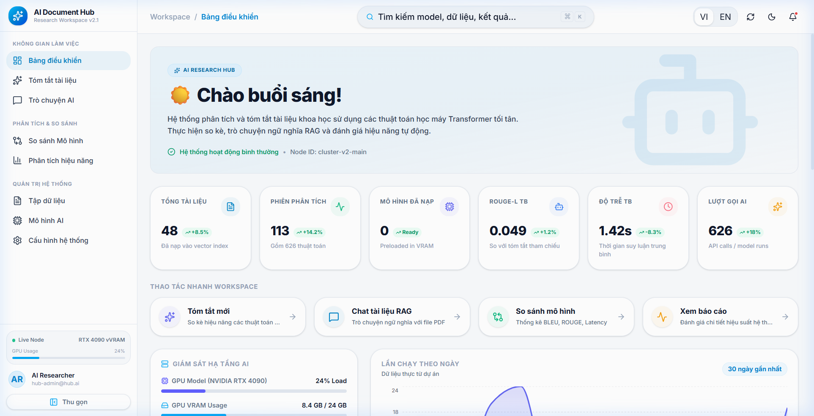

### Summarize & Compare Algorithms

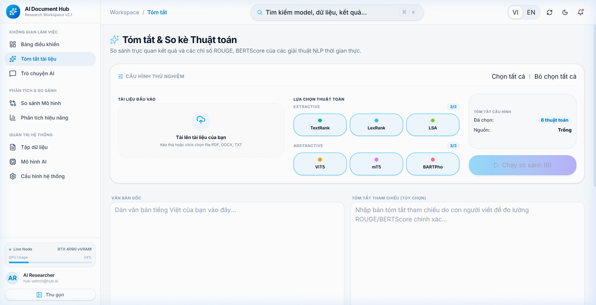

### Model Comparison & Leaderboard

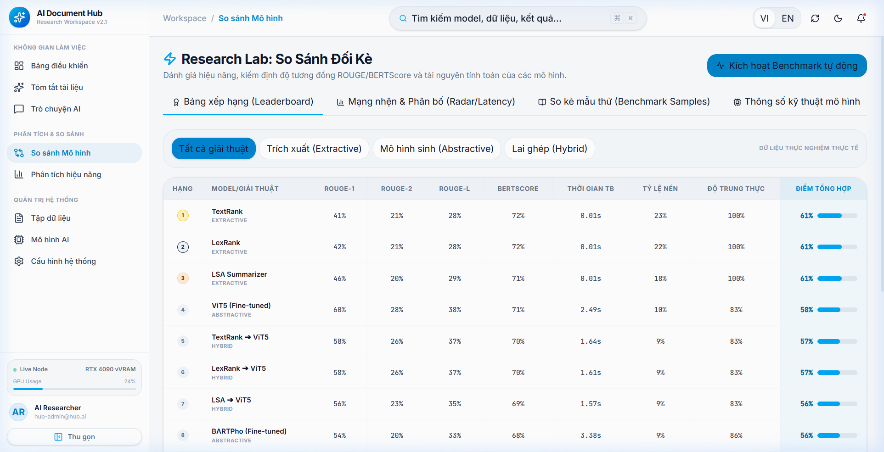

### Benchmark Results

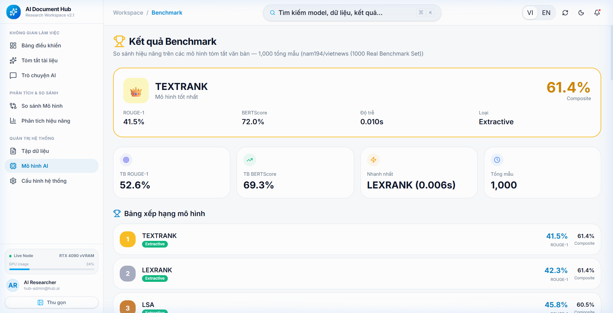

### ChatRAG — Document Q&A

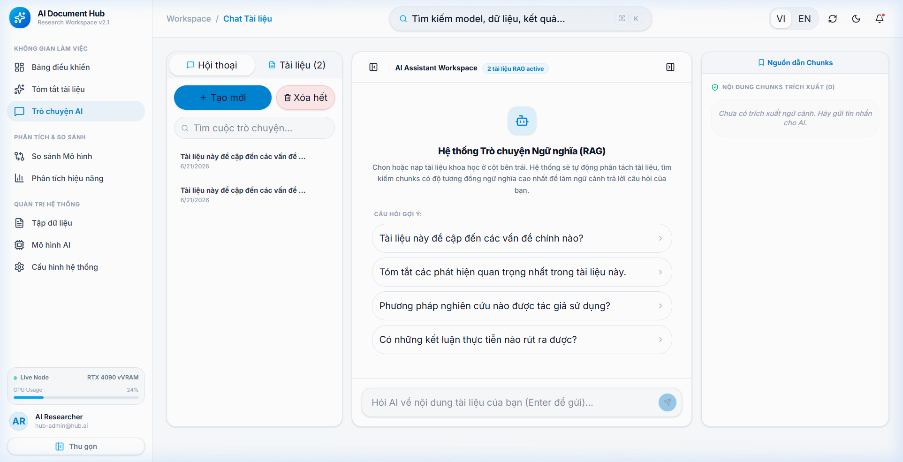

### Analytics & Reports

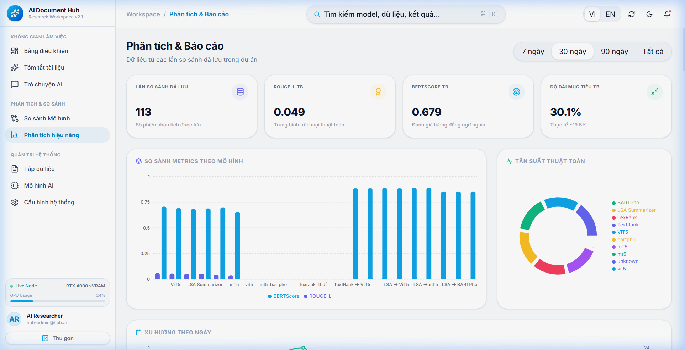

### Document Intelligence

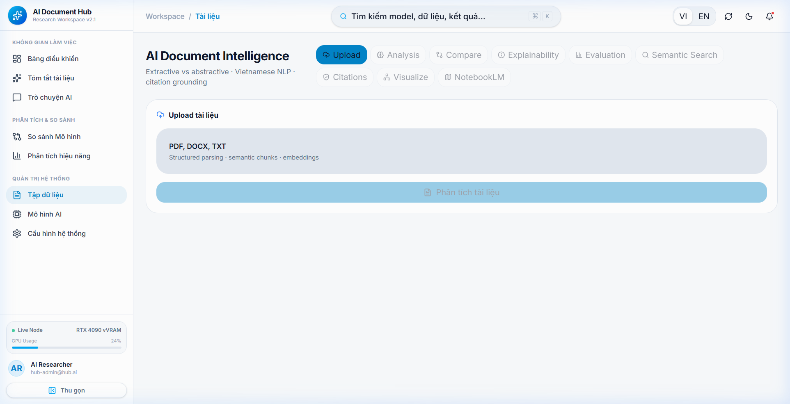

### Settings

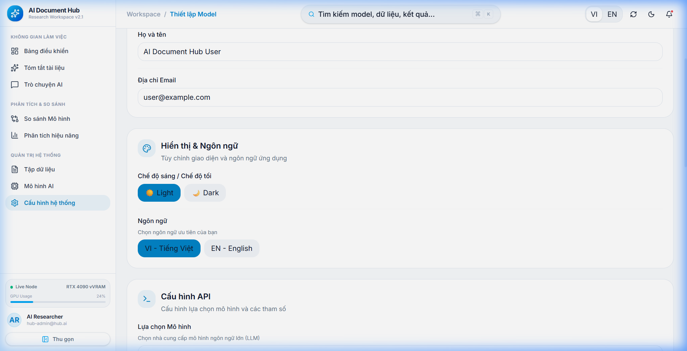

---

## Future Work

| Area | Description |
|:---|:---|
| Human evaluation workflow | Structured UI for manual quality assessment alongside automated metrics |
| Multi-GPU training | Distributed training support for larger datasets |
| FAISS integration | Alternative vector store backend for large-scale deployments |
| Online learning | Continual fine-tuning with user feedback |
| TTS export | Text-to-speech podcast generation from summaries |
| LangChain integration | Modular RAG components via LangChain framework |
| Extended language support | Beyond Vietnamese — multilingual summarization |

---

## License

This project is licensed under the MIT License. See [LICENSE](LICENSE) for details.

---

## Authors

**Nguyễn Hữu Toàn**

Graduation thesis project — Vietnamese Text Summarization System using Transformer models.

---

## Citation

If you use this project in your research, please cite:

```bibtex
@misc{nguyen2025vietnamese_summarization,
  title   = {Vietnamese Text Summarization and Document Q&A System using Transformer Models},
  author  = {Nguyen, Huu Toan},
  year    = {2025},
  url     = {https://github.com/tuilatoan15/NLP-Text-Summarization-Transformer-System}
}
```
