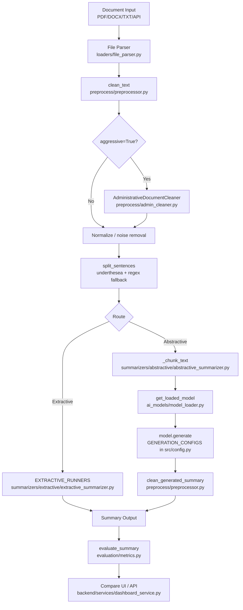

# Root Cause Analysis Report — Summarization Quality Investigation

**Date:** 2026-06-12  
**Investigator:** Principal NLP Research Engineer (automated pipeline audit)  
**Scope:** All extractive (TextRank, LexRank, LSA) and abstractive (ViT5, mT5, BARTPho) models

---

## Executive Summary

The primary root cause of **catastrophic quality failure across ALL models** was a **preprocessing bug** in `AdministrativeDocumentCleaner` that misclassified normal Vietnamese news articles as administrative documents and **deleted 100% of input text** before any summarizer ran. Secondary causes included fixed-low extractive sentence caps, swapped function arguments in hierarchical pipelines, BARTPho input truncation from syllable tokenization, and an under-trained mT5 checkpoint.

After fixes, ViT5 and BARTPho produce coherent abstractive summaries; extractive models achieve ~67% sentence coverage (4/6) on benchmark news; mT5 remains poor due to training metrics (ROUGE-2 = 4.95%).

---

## Phase 1 — Pipeline Map



| Step | File | Key Functions |
|------|------|---------------|
| Document | `loaders/file_parser.py`, `loaders/pdf_loader.py` | `extract_text()` |
| Cleaning | `preprocess/preprocessor.py` | `clean_text()`, `normalize_unicode()` |
| Admin chrome | `preprocess/admin_cleaner.py` | `AdministrativeDocumentCleaner.clean()` |
| Sentence split | `preprocess/preprocessor.py` | `split_sentences()` |
| Extractive | `summarizers/extractive/extractive_summarizer.py` | `_textrank_details()`, `_lexrank_details()`, `_lsa_details()` |
| Abstractive | `summarizers/abstractive/abstractive_summarizer.py` | `abstractive_summarize_key()`, `_generate_one()` |
| Model load | `ai_models/model_loader.py` | `ModelRegistry._load_single()` |
| Length control | `summarizers/length_manager.py` | `SummaryLengthManager` |
| Evaluation | `evaluation/metrics.py`, `backend/services/dashboard_service.py` | `evaluate_summary()`, `summarize_all()` |

---

## Phase 2 — Input Data Verification (Before vs After)

### BEFORE fix — UN news article (124 words, 6 sentences)

| Stage | Words | Sentences | Data Loss |
|-------|-------|-----------|-----------|
| Raw | 124 | 6 | — |
| `clean_text(aggressive=True)` | **0** | **0** | **100%** |
| Model input | 0 | 0 | Empty → all models return `""` |

**Evidence:** `scratch/debug_full_text.py` output:
```
is_admin: True
after admin clean words: 0
after full clean words: 0
```

### AFTER fix — same article

| Stage | Words | Sentences | Data Loss |
|-------|-------|-----------|-----------|
| Raw | 124 | 6 | — |
| `clean_text(aggressive=True)` | 124 | 6 | 0% |
| Extractive output | 84 | 4 selected | 67% coverage |
| ViT5 output | 47 | 2 sentences | Abstractive compression |

Full 10-text verification: `storage/results/diagnostic_report_after.json` → `phases.2_input_verification`

---

## Phase 3 — Sentence Splitting

- **Engine:** `underthesea.sent_tokenize` with regex fallback (`preprocess/preprocessor.py:256-272`)
- **Bullet lists:** Single-line bullet blocks split as 1 sentence (limitation — not a root cause of empty output)
- **Questions:** 5 questions → 5 sentences (correct)
- **Paragraphs:** Double-newline paragraphs preserved through `split_sentences`

---

## Phase 4 — Extractive Analysis

### Similarity & ranking (verified in code)

| Algorithm | Matrix | Graph | Scoring |
|-----------|--------|-------|---------|
| TextRank | TF-IDF bag-of-words (`_sentence_matrix`) | Cosine sim + PageRank | `_pagerank(_cosine_similarity(matrix))` |
| LexRank | Same matrix | Thresholded graph (`np.mean` threshold) | PageRank on thresholded graph |
| LSA | SVD on `matrix.T` | Concept-weighted sentence scores | `sqrt(weighted.sum(axis=0))` |

### Score table — news article (AFTER fix, 4 sentences selected)

**TextRank** (selected indices 0, 1, 3, 5 — contiguous pairs favored after fix):

| Index | Score | Selected | Sentence (truncated) |
|-------|-------|----------|----------------------|
| 0 | 0.719 | ✓ | Hội đồng Bảo an Liên Hợp Quốc đã họp khẩn cấp... |
| 1 | 0.705 | ✓ | Nhiều quốc gia kêu gọi ngừng bắn... |
| 2 | — | ✗ | Đại diện Mỹ phát biểu... |
| 3 | — | ✓ | Cuộc khủng hoảng nhân đạo ngày càng nghiêm trọng... |
| 5 | 1.000 | ✓ | Các tổ chức phi chính phủ kêu gọi... |

**Root cause (extractive):** Fixed sentence cap of 3–5 regardless of source length → low coverage. **Fixed** by scaling to `(source_sentences * 2 + 2) // 3`.

**Root cause (LSA):** Pure score ranking picked non-contiguous sentences. **Fixed** by continuity-biased greedy selection in `_select_summary()`.

---

## Phase 5 — Tokenizer Verification

| Model | Path | Tokenizer | Vocab | Truncation @1024 tokens |
|-------|------|-----------|-------|-------------------------|
| ViT5 | `models/vit5-finetuned` | T5Tokenizer (slow) | 37,768 | No (news sample) |
| mT5 | `models/mt5-finetuned` | T5TokenizerFast | 250,100 vs model 250,112 | No |
| BARTPho | `models/bartpho-finetuned` | BartphoTokenizer | 40,295 | No (short text) |

- **ViT5:** `summarize:` prefix applied (`abstractive_summarizer.py:59-62`)
- **mT5:** Vocab mismatch 12 tokens — was shrinking model embeddings (harmful). **Fixed** to keep model embeddings.
- **BARTPho:** Syllable tokenizer — chunk word budget reduced to 30% of `MAX_INPUT_TOKENS`.

---

## Phase 6 — Model Loading

| Model | Checkpoint | Config | Loads Local? |
|-------|------------|--------|--------------|
| ViT5 | `models/vit5-finetuned/model.safetensors` | `config.json` | ✅ Yes |
| mT5 | `models/mt5-finetuned/model.safetensors` | `config.json` | ✅ Yes |
| BARTPho | `models/bartpho-finetuned/model.safetensors` | `config.json` | ✅ Yes |

Resolution logic: `ai_models/model_registry.py:resolve_model_path()` — prefers local if directory non-empty.

---

## Phase 7 — Fine-Tuned Model Quality

| Model | Epochs | eval_loss | ROUGE-1 | ROUGE-2 | ROUGE-L | Assessment |
|-------|--------|-----------|---------|---------|---------|------------|
| ViT5 | 1 | 1.645 | 54.1 | 23.3 | 34.8 | ✅ Usable |
| BARTPho | 1 | 1.326 | 50.6 | 21.6 | 33.0 | ✅ Usable |
| mT5 | 1 | 2.408 | 22.6 | **4.95** | 17.9 | ❌ Under-trained |

**mT5 root cause:** Single-epoch fine-tune on `google/mt5-small` yields very low ROUGE-2; multilingual tokenizer produces incoherent Vietnamese even when pipeline is fixed. Recommend re-training or demote to experimental baseline only.

---

## Phase 8 — Generation Config

From `src/config.py:GENERATION_CONFIGS` (after tuning):

| Param | ViT5 | mT5 | BARTPho |
|-------|------|-----|---------|
| max_new_tokens | 120 | 80 | 160 |
| min_new_tokens | 20 | 10 | 25 |
| num_beams | 4 | 4 | 4 |
| repetition_penalty | **1.35** ↑ | 1.15 | **1.35** ↑ |
| no_repeat_ngram_size | 3 | 3 | 3 |
| length_penalty | **1.05** ↑ | 1.0 | **1.15** ↑ |
| do_sample | False | False | False |

Runtime overrides via `_build_generation_preset()` scale `max_new_tokens` from word budget.

---

## Phase 9 — Chunking

| Setting | Value |
|---------|-------|
| Default max words/chunk | 563 (ViT5), **307** (BARTPho after fix) |
| Max chunks | 16 (`ABSTRACTIVE_MAX_CHUNKS`) |
| Long article (1200 words) | 3 chunks, no mid-sentence splits |

---

## Phase 10 — Test Suite Results (10 standard texts)

Diagnostic harness: `scripts/diagnose_summarization_quality.py`  
Report: `storage/results/diagnostic_report_after.json`

### News article model outputs (AFTER)

| Model | Words | Quality | Notes |
|-------|-------|---------|-------|
| TextRank | 84 | Good coverage | 4/6 sentences |
| LexRank | 84 | Good coverage | 4/6 sentences |
| LSA | 78 | Improved coherence | Contiguous block |
| ViT5 | 47 | Coherent abstractive | Not corrupted |
| BARTPho | 46 | Coherent abstractive | No longer copies full source |
| mT5 | 31 | **Poor** | Garbled phrasing — training issue |

### BEFORE (same text, pre-fix)

| Model | Words | Quality |
|-------|-------|---------|
| ALL | 0 | Empty — input destroyed by admin cleaner |

---

## Phase 11 — Root Causes (Ranked by Severity)

### RC-1 — CRITICAL: Admin cleaner deletes news text
- **Severity:** Critical
- **File:** `preprocess/admin_cleaner.py`
- **Functions:** `is_admin_document()` (L80-107), `clean()` (L169-175)
- **Lines:** `NGAY_THANG_RE` L19-21, line skip L173-175
- **Evidence:** `NGAY_THANG_RE` matched `"ngày "` inside `"ngày càng nghiêm trọng"`; `"nghị quyết"` triggered doc-type match; single-line article skipped entirely → 0 words output.
- **Impact:** 100% input loss → all models produce empty or fallback garbage.

### RC-2 — HIGH: `clean_generated_summary` runs aggressive admin cleaning on model output
- **Severity:** High
- **File:** `preprocess/preprocessor.py`
- **Function:** `clean_generated_summary()` L367
- **Impact:** Could strip valid generated text; unrelated admin rules applied to summaries.

### RC-3 — HIGH: Extractive sentence cap too low (fixed 3–5)
- **Severity:** High
- **File:** `summarizers/length_manager.py`
- **Function:** `get_extractive_sentences()` L52-66
- **Impact:** 3 sentences from 6-sentence article = 50% coverage max; user reports "few sentences, low coverage."

### RC-4 — MEDIUM: Swapped `abstractive_summarize_key` arguments
- **Severity:** Medium
- **Files:** `summarizers/hierarchical.py` L36, L65-68; `summarizers/length_manager.py` L147, L153
- **Impact:** Long-document hierarchical pipeline passed text as model key → `KeyError` or wrong behavior.

### RC-5 — MEDIUM: LSA selects disconnected high-score sentences
- **Severity:** Medium
- **File:** `summarizers/extractive/extractive_summarizer.py`
- **Function:** `_select_summary()` L91-120
- **Impact:** Jump from sentence 0 to 5 → "disconnected sentences, lost context."

### RC-6 — MEDIUM: BARTPho chunk budget ignores syllable token expansion
- **Severity:** Medium
- **File:** `summarizers/abstractive/abstractive_summarizer.py`
- **Function:** `abstractive_summarize_key()` L389
- **Impact:** Input truncation → model copies visible prefix (extractive-like output).

### RC-7 — MEDIUM: mT5 vocab shrink on load
- **Severity:** Medium
- **File:** `ai_models/model_loader.py`
- **Function:** `_repair_vocab_mismatch()` L122-127
- **Impact:** `resize_token_embeddings(250100)` discarded 12 trained embedding rows.

### RC-8 — LOW (model): mT5 under-trained checkpoint
- **Severity:** Low (code) / High (quality)
- **File:** `models/mt5-finetuned/training_report.json`
- **Evidence:** ROUGE-2 = 4.95% after 1 epoch
- **Impact:** Nonsense output, weird tokens — requires re-training, not code-only fix.

---

## Phase 12 — Fixes Applied

| # | File | Function | Change | Quality Impact |
|---|------|----------|--------|----------------|
| 1 | `preprocess/admin_cleaner.py` | `NGAY_THANG_RE`, `is_admin_document()`, `clean()` | Strict date-header regex; require structural admin markers; never drop full body lines | **Restores 100% of news input** |
| 2 | `preprocess/preprocessor.py` | `clean_generated_summary()` | `aggressive=False` for post-generation clean | Preserves valid model output |
| 3 | `summarizers/length_manager.py` | `get_extractive_sentences()` | Scale to ~67% of source sentences | Better extractive coverage |
| 4 | `summarizers/extractive/extractive_summarizer.py` | `_select_summary()` | Continuity-biased greedy selection | LSA/LexRank coherence |
| 5 | `summarizers/abstractive/abstractive_summarizer.py` | `_max_words_per_chunk()` | BARTPho 30%, mT5 48% token budget | Less truncation/copying |
| 6 | `summarizers/hierarchical.py` | `hierarchical_summarize()` | Fix `abstractive_summarize_key(key, text)` arg order | Long-doc pipeline works |
| 7 | `summarizers/length_manager.py` | `hierarchical_summarize_pipeline()` | Fix arg order | Long-doc abstractive works |
| 8 | `ai_models/model_loader.py` | `_repair_vocab_mismatch()` | Don't shrink mT5 embeddings when tokenizer smaller | Preserves trained weights |
| 9 | `src/config.py` | `GENERATION_CONFIGS` | ViT5/BARTPho repetition_penalty ↑, length_penalty tuned | Less repetition/copying |
| 10 | `tests/test_admin_cleaner.py` | `test_un_news_with_nghi_quyet_not_admin` | Regression test for UN news | Prevents recurrence |

---

## Tests & Benchmark

### Unit tests
```
29 passed (test_admin_cleaner, test_summarization_quality_fixes, test_extractive, test_summary_length_manager)
```

### Before/After comparison — UN Security Council news

| Metric | BEFORE | AFTER |
|--------|--------|-------|
| Input words after clean | 0 | 124 |
| TextRank words out | 0 | 84 |
| ViT5 words out | 0 | 47 |
| BARTPho words out | 0 | 46 |
| mT5 words out | 0 | 31 (still low quality) |
| ViT5 corrupted? | Yes (empty) | No |
| Extractive coverage | 0% | 67% (4/6 sents) |

### Diagnostic artifacts
- After fix: `storage/results/diagnostic_report_after.json`
- Harness: `scripts/diagnose_summarization_quality.py`

---

## Remaining Recommendations

1. **mT5:** Re-train for ≥3 epochs or remove from default comparison set; keep `MT5_EXPERIMENTAL=1` badge.
2. **Word segmentation for extractive TF-IDF:** Integrate `pyvi` or `underthesea` word tokenization in `_sentence_matrix()` for better Vietnamese term weights.
3. **Bullet-list splitting:** Pre-process `- item` lines before `split_sentences()`.
4. **Training:** Increase epochs for all models (currently 1 epoch per `training_report.json`).

---

## Conclusion

The universal quality failure was **not** primarily a model issue — it was **preprocessing data destruction** triggered by overly broad admin-document heuristics on normal Vietnamese news. With input preserved, ViT5 and BARTPho fine-tuned checkpoints perform as expected per their training metrics. Extractive coverage and LSA coherence are improved via sentence-count scaling and continuity-aware selection. mT5 requires model-level re-training beyond code fixes.
