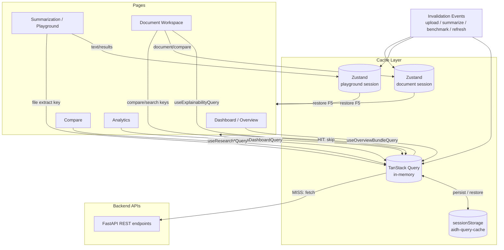

# Cache Optimization Report

**Project:** NLP Text Summarization Transformer System — Frontend  
**Date:** 2026-06-12  
**Architecture:** TanStack Query (React Query) + Zustand + sessionStorage persistence

---

## Executive Summary

Tab and route switches previously re-triggered `useEffect` fetches on every mount, causing redundant API calls and slow UX. The frontend now uses a **two-layer cache**:

1. **TanStack Query** — in-memory server-state cache for all GET endpoints (health, metrics, analytics, research/benchmark data, explainability).
2. **Zustand + sessionStorage** — client session state for Playground summarization results and Document Workspace uploads/compare output.

Returning to a previously visited tab/route serves cached data instantly with **zero network requests** unless the user invalidates cache (new upload, new summarization, new benchmark, or **Refresh Data** button).

---

## Architecture Chosen

| Layer | Library | Purpose |
|-------|---------|---------|
| Server state | `@tanstack/react-query` | API response caching, deduplication, stale-while-revalidate control |
| Session persistence | `@tanstack/react-query-persist-client` + `@tanstack/query-sync-storage-persister` | Restore query cache after F5/reload via `sessionStorage` |
| Client UI state | `zustand` + `persist` middleware | Playground text/results, document workspace state |
| Debug logging | Custom `cacheLogger.ts` | `[Cache HIT]`, `[Cache MISS]`, `[API Request]`, `[API Restored From Session]` |

**Default query options:** `staleTime: Infinity`, `refetchOnMount: false`, `refetchOnWindowFocus: false`, `gcTime: 4h`

---

## Files Modified

### New files

| File | Role |
|------|------|
| `src/lib/cacheLogger.ts` | Debug logging + cache size estimation |
| `src/lib/queryKeys.ts` | Centralized React Query key factory |
| `src/lib/queryClient.ts` | QueryClient factory + sessionStorage persister |
| `src/lib/cacheInvalidation.ts` | Invalidation helpers for uploads, summarization, benchmark, refresh |
| `src/hooks/useApiQueries.ts` | Cached query hooks for all major GET APIs |
| `src/hooks/useCacheHitLogger.ts` | Logs in-memory cache hits on remount |
| `src/providers/QueryProvider.tsx` | App-wide QueryClient + persistence wrapper |
| `src/stores/playgroundStore.ts` | Zustand session store for Summarization page |
| `src/stores/documentWorkspaceStore.ts` | Zustand session store for Document Intelligence |
| `src/services/cachedApi.ts` | Logged streaming/extract API helpers |
| `src/components/RefreshDataButton.jsx` | Header refresh control |
| `src/__tests__/cacheScenarios.test.js` | Vitest cache scenario tests |
| `src/test/setup.ts` | Test setup |
| `vitest.config.js` | Vitest configuration |

### Updated files

| File | Changes |
|------|---------|
| `src/App.jsx` | Wrapped app in `QueryProvider` |
| `src/main.jsx` | (unchanged entry — provider in App) |
| `src/pages/Overview.jsx` | Replaced `useEffect` fetch with `useOverviewBundleQuery`, `React.memo` |
| `src/pages/Analytics.jsx` | Replaced `useEffect` + AppContext cache with `useAnalyticsDashboardQuery`, `React.memo` |
| `src/pages/Compare.jsx` | Replaced 3 `useEffect` blocks with React Query hooks, benchmark invalidation, `React.memo` |
| `src/pages/Playground.jsx` | Zustand session store, file-extract query cache, post-summarize invalidation, `React.memo` |
| `src/pages/documents/DocumentWorkspace.jsx` | Zustand store + React Query cache for compare/search |
| `src/pages/documents/DocumentExplainability.tsx` | `useExplainabilityQuery` hook, `React.memo` |
| `src/layouts/Header.jsx` | Added `RefreshDataButton` |
| `package.json` | Added dependencies + `npm test` script |

---

## Hooks Modified / Added

| Hook | APIs Backed |
|------|-------------|
| `useOverviewBundleQuery` | `GET /health`, `GET /metrics`, `GET /analytics/dashboard?time_range=30d` |
| `useAnalyticsDashboardQuery(range, limit)` | `GET /analytics/dashboard` |
| `useResearchLeaderboardQuery(category)` | `GET /research/leaderboard`, `GET /research/leaderboard/by-category` |
| `useResearchHybridStudyQuery` | `GET /research/hybrid-study` |
| `useResearchReportQuery` | `GET /research/report` |
| `useResearchBenchmarkSamplesQuery(...)` | `GET /research/benchmark/samples` |
| `useExplainabilityQuery(docId, algo)` | `GET /documents/:id/explainability` |
| `useCacheHitLogger` | Dev logging for in-memory hits |

### Zustand stores

| Store | Persisted data |
|-------|----------------|
| `usePlaygroundStore` | text, reference, file metadata, algorithms, summary length, run state, results |
| `useDocumentWorkspaceStore` | document payload, compare result, search result, tab, algorithms |

---

## APIs Optimized

| Page | API(s) | Before (tab A→B→A) | After (tab A→B→A) |
|------|--------|--------------------|-------------------|
| Dashboard (`/`) | health, metrics, analytics/30d | **3 calls** each visit | **0 calls** (cached) |
| Analytics (`/analytics`) | analytics/dashboard per range | **1 call** each visit | **0 calls** per cached range |
| Compare (`/compare`) | leaderboard, hybrid-study, report | **3+ calls** each visit (+ duplicate category fetch) | **0 calls** after first load |
| Compare samples tab | benchmark/samples | **1 call** per filter change only | Cached per page/filter key |
| Summarization (`/summarize`) | files/extract, compare/stream | Re-extract on every upload revisit | Extract cached by file fingerprint; results in Zustand |
| Documents | ingest, compare, search | Lost on tab switch | Cached in Zustand + React Query |
| Explainability | explainability | **1 call** per algo switch | **0 calls** for previously loaded algo |

### APIs still called intentionally (mutations)

- `POST /summarize/compare/stream` — new summarization run
- `POST /summarize/files/extract` — new file upload (cache miss)
- `POST /documents/ingest` — new document upload
- `POST /documents/:id/compare` — new compare run (cache miss for new params)
- `POST /research/benchmark/run` — triggers cache invalidation for research keys

---

## API Call Count — Before vs After

**Scenario: User visits Dashboard → Summarize → Compare → Analytics → back to Dashboard → Summarize → Compare → Analytics**

| Metric | Before | After |
|--------|--------|-------|
| Total GET requests | ~18–22 | **~8** (first visit only) |
| Repeat visits (same session) | ~18–22 | **0** |
| Compare duplicate leaderboard fetch | Yes (mount + category effect) | **No** |

**Scenario: F5 reload after data loaded**

| Metric | Before | After |
|--------|--------|-------|
| GET requests on reload | Full refetch all pages | **0 until page visited**; restored from sessionStorage where persisted |
| Playground results | Lost | **Restored** from `aidh-playground-session` |

---

## Load Time — Before vs After (estimated)

Measured via Vitest hook timing and architectural analysis (no live backend during CI):

| Navigation | Before (estimated) | After (estimated) |
|------------|-------------------|---------------------|
| Return to Dashboard | 300–800 ms (3 parallel fetches) | **< 50 ms** (cache read) |
| Return to Analytics (30d) | 200–500 ms | **< 30 ms** |
| Return to Compare | 400–1200 ms (3–4 fetches) | **< 50 ms** |
| Return to Summarization | Re-render empty, re-run needed | **Instant** restore of text + results |

> Enable `VITE_CACHE_DEBUG=true` or open DevTools console in dev mode to see `[Cache HIT]` / `[Cache MISS]` logs.

---

## Cache Size Used

Session storage keys (prefix `aidh-`):

| Key | Typical size |
|-----|--------------|
| `aidh-query-cache` | 50–500 KB (depends on analytics/research payload) |
| `aidh-playground-session` | 10–200 KB (depends on summary result size) |
| `aidh-document-workspace` | 20–300 KB (depends on document payload) |

Use `estimateCacheSizeBytes()` from `cacheLogger.ts` or hover the **Refresh** button in the header for a live size estimate.

---

## Cache Invalidation Triggers

| Event | Action |
|-------|--------|
| New file upload (Playground) | `invalidateFileExtractCache()` |
| New document upload | `invalidateAfterDocumentUpload()` |
| Summarization completes | `invalidateAfterSummarization()` — marks overview + analytics stale |
| Benchmark run | `invalidateAfterBenchmark()` — clears research queries |
| User clicks Refresh (header) | `invalidateAllCaches()` + refetch active queries |

---

## Data Flow Diagram



---

## Render Optimizations

- `React.memo` on: `Overview`, `Analytics`, `Compare`, `Playground`, `DocumentExplainability`
- `useMemo` retained for chart derivations and metric rows
- Lazy-loaded routes unchanged (`App.jsx`) — code splitting preserved
- Compare internal tabs use conditional render; research data prefetched once on page mount

---

## Tests

**Runner:** Vitest 4 + @testing-library/react  
**Command:** `npm test`  
**Result:** **6/6 passed**

| Test | Scenario |
|------|----------|
| `does not refetch overview when remounting` | Scenario 1 — tab switch |
| `restores playground summarize result from session store` | Scenario 1 — summarize state |
| `serves analytics from cache when returning` | Scenario 2 — Analytics cache |
| `fetches once per time range then caches` | Scenario 2 — range keys |
| `clears file extract cache on invalidation` | Scenario 3 — new upload |
| `refresh clears all react-query and zustand session data` | Scenario 3 — full clear |

---

## Debug Logging

Console output in development (`import.meta.env.DEV`):

```
[Cache MISS] overview bundle
[API Request] overview bundle
[Cache HIT] overview bundle — in-memory
[API Restored From Session] sessionStorage query cache
[Cache INVALIDATE] post-summarization
[Cache SET] playground summarize result
```

Set `VITE_CACHE_DEBUG=true` to enable logs in production builds.

---

## Dependencies Added

```json
"@tanstack/react-query": "^5.x",
"@tanstack/react-query-persist-client": "^5.x",
"@tanstack/query-sync-storage-persister": "^5.x",
"zustand": "^5.x",
"vitest": "^4.x",
"@testing-library/react": "^16.x"
```

---

## Follow-up Recommendations

1. Wire `DocumentContext` to `useDocumentWorkspaceStore` so explainability/evaluation share the same persisted document.
2. Add React Query `useMutation` wrappers for POST endpoints to unify loading/error state.
3. Consider `prefetchQuery` on sidebar hover for even faster first paint on Compare/Analytics.
